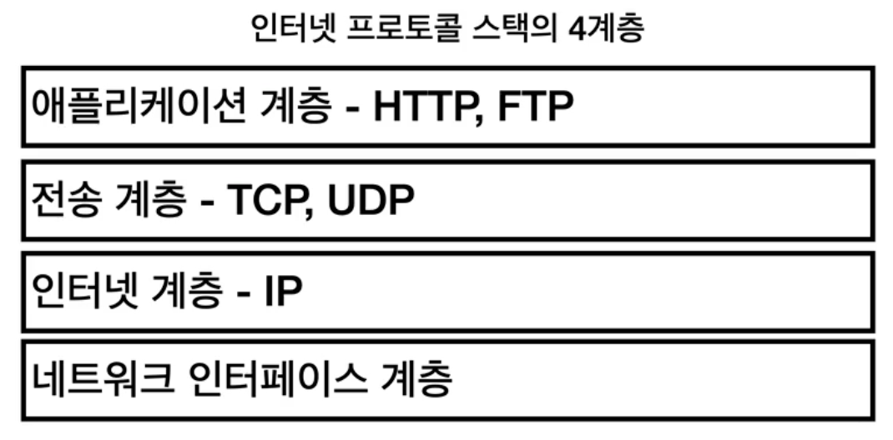
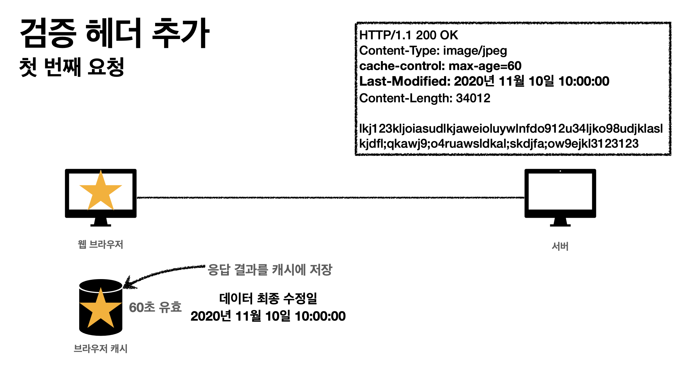
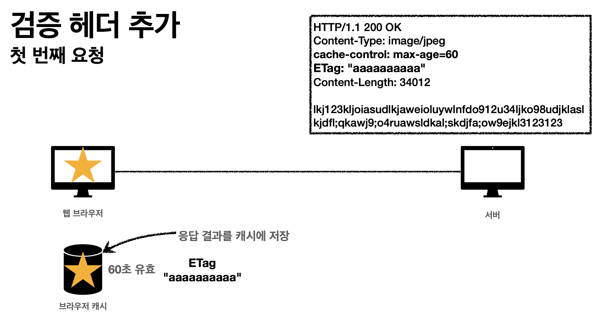
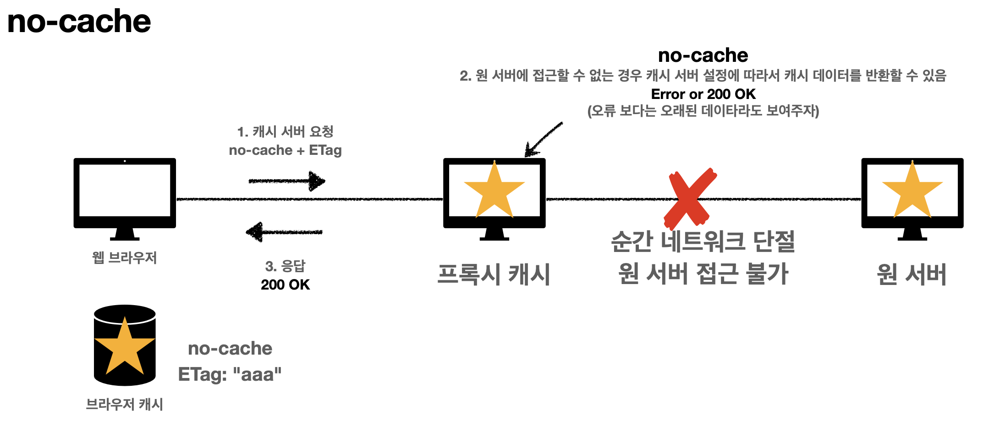
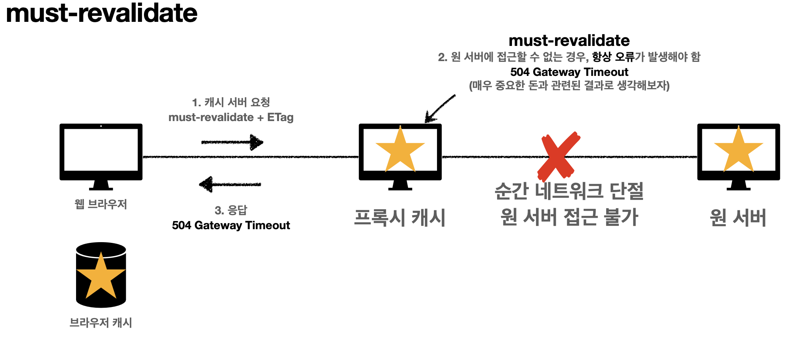

## 1. 인터넷 네트워크
### 1-1. 인터넷 통신
인터넷은 단순하지 않기 때문에 수많은 중간 노드(서버)를 거쳐서 넘어가야한다.
그럼 어떻게 넘어가는가 ?
### 1-2. IP(인터넷 프로토콜)
데이터를 전달할 목적지를 전달할 주소 : IP Address
패킷(Packet)이라는 통신 단위로 데이터를 전달한다
클라이언트 패킷을 전달하기 위해, 출발지 목적지 내용을 포함하여 던지면 노드들 끼리 정해진 프로토콜대로 목적지를 찾아간다.
**IP 프로토콜의 한계**
1. 비연결성 : 받을 대상이 없거나 서비스 불능 상태여도 패킷 전송
2. 비신뢰성 : 중간에 패킷이 사라지거나 순서대로 오지 않는다면?
3. 같은 IP를 사용하는 서버에서 통신하는 애플리케이션이 둘 이상이라면 어떻게 구분?
### 1-3. TCP, UDP

TCP : IP 프로토콜의 문제점들을 해결하는 것. IP의 위에있는 계층으로서 보완해줌

IP 패킷 정보 : 출발지 IP, 목적지 IP, 기타 등등
TCP 패킷 정보 : 출발지 PORT, 목적지 PORT, 전송제어정보, 순서정보, 검증 정보 등
  
**TCP(전송제어프로토콜)의 특징**
- 연결 지향 : 연결을 하고 메시지를 보냄 (3 way handshake)

SYN : 접속 요청 , ACK : 요청 수락. / 서버와 클라이언트가 서로 신뢰할 수 있게됨
- 데이터 전달을 보증함

- 순서를 보장함

  
**UDP(사용자 데이터그램 프로토콜) 특징**
- 연결지향 x, 데이터 전달 보증 x, 순서 보장 x, 단순하고 빠름
- IP와 거의 같으나 PORT, 체크섬 정도만 추가
- 애플리케이션에서 추가 작업이 필요하다
### 1-4. PORT
같은 IP에서 한번에 둘 이상을 연결해야 한다면? 포트를 사용한다.
IP 의 내부에서 애플리케이션을 확인하는 방법으로 포트를 사용한다.
패킷을 보낼때 출발지 포트, 도착지 포트를 명시하기때문에 출발포트 도착포트를 양쪽이 알고있다.
### 1-5. DNS
IP는 변경될 수 있다. 그러면 기존의 연결에서 접근을 못하게되지않나?
DNS (도메인 네임 시스템) : 도메인 명을 등록을 하고 IP 주소를 바꿀 수 있다.
## 2. URI와 웹 브라우저 요청 흐름
### 2-1. URI
URI = uniform(통일된 방식) resource(자원) identifier(식별자)
URI는 resource의 로케이터(locator → URL) 와 이름(name → URN)으로 구분할 수 있다.

> ==예시==  
> URL : foo://example.com:8042/over/there?name=ferret\#nose  
> URN : urn:example:animal:ferret:nose  
> 대부분  
> URL만 사용한다.
**URL의 문법**
scheme://[userinfo@]host[:port][/path][?query][\#fragment]
- scheme은 http, https 등
- userinfo는 거의 사용하지않음
- host는 도메인 주소
- port는 생략가능
- path는 리소스 경로, 계층적으로 이루어져있음
- query는 key-value의 형태로 데이터가 들어가고, 다 문자로 들어감
- fragmen는 html 내부 정보로 사용하고 서버로 전송되지는 않는다.
### 2-2. 웹브라우저의 요청 흐름
1. DNS, PORT 조회 (포트는 생략가능)
2. HTTP 요청메시지 생성
3. 소켓 라이브러리를 통해 전달 (TCP/IP 연결, 데이터 전달)
4. TCP/IP 패킷 생성, HTTP메시지 포함
## 3. HTTP 기본
### 3-1. 클라이언트 서버 구조

클라이언트는 서버에 요청을 보내고, 응답을 대기한다.
서버는 요청에 대한 결과를 만들어서 응답한다.
비즈니스 로직, 데이터들을 서버에 다 밀어 넣어두고, 클라이언트는 UI와 사용성에 집중하도록 분리를 시킨다 → 매우중요. 각각이 따로따로 진화가 가능하기 때문
### 3-2. Stateful, Stateless
HTTP는 무상태 프로토콜을 유지한다. (Stateless)
→ 무상태는 응답 서버를 쉽게 바꿀 수 있다 = 무한한 서버 증설 가능

### 3-3. 비연결성 (conncectionless)
- HTTP는 기본이 연결을 유지하지 않는 모델이다.
- 일반적으로 초 단위의 이하의 빠른속도로 응답
그러나 이렇게 비연결 상태라면 항상 TCP/IP 연결을 새로 맺어야함 (3 way handshake)

→ 지금은 HTTP 지속 연결로 문제를 해결 (http 2, 3에서는 훨씬 개선되었음)

### 3-4. HTTP 메시지

→ 공백은 반드시 있어야 한다.
**시작라인 (요청 메시지)**
- 종류 (GET, POST, PUT, DELETE) 를 갖는다. 중요 !!
- 요청메시지의 요청 대상
- HTTP 버전
**시작라인 (응답 메시지)**
- HTTP 버전
- HTTP 상태 코드 ( 요청 성공, 실패를 나타내는 ) 중요 !!
- 이유 문구
**HTTP 헤더**
- http 전송에 필요한 모든 부가정보
**HTTP 메시지 바디**
- 실제 전송할 데이터
- html문서, 이미지, 영상, JSON 등등 byte로 표현할 수 있는 모든 데이터 전송 가능
## 4. HTTP 메서드
### 4-1. HTTP API 만들기
URI 설계의 가장 중요한 것 : 리소스를 식별 (ex. 회원을 조회하는 기능에서 리소스는 회원)
(참고 : 계층 구조상 상위를 컬렉션으로 보고 복수단어 사용 권장)
URI에서는 리소스와 행위를 분리 시켜야한다. 행위를 메서드로 구분함
- GET: 리소스 조회
- POST: 요청 데이터 처리, 주로 등록
- PUT: 리소스를 대체, 해당 리소스가 없으면 생성
- PATCH: 리소스 부분 변경
- DELETE: 리소스 삭제
### 4-2. GET, POST
GET : 리소스 조회. 서버에 전달하고 싶은 데이터는 query를 통해서 전달
POST : 요청 데이터 처리, 메시지 바디를 통해서 서버로 요청 데이터 전달, 서버는 요청 데이터를 처리 (GET에서 조회데이터를 넘겨야하는데 GET 메서드를 사용하기 어려운 경우, 애매한 경우에도 사용을 한다.)
### 4-3. PUT, PATCH, DELETE
PUT : 리소스를 대체. 해당 리소스가 없으면 생성 (덮어버림), 클라이언트가 리소스를 알고 URI 를 지정한다.
PATCH : 리소스를 부분만 변경.
DELETE : 리소스를 제거
### 4-4. HTTP 메서드의 속성

**안전하다 의 개념** : 호출해도 리소스를 변경하지 않는다.
**멱등 의 개념** : 한번 호출하든 두번 호출하든 100번 호출하든 결과가 똑같다.
→ GET, PUT, DELETE는 멱등하고 POST는 그렇지 않다
→ ex ) 자동 복구 매커니즘. 서버가 요청을 처리했는지 몰라서 한번더 처리해야하는 경우 PUT쓰면되겠지?
**캐시가능하다 의 개념** : 응답 결과 리소스를 캐시해서 사용해도 되는가?
→ GET, HEAD, POST, PATCH는 캐시가능
→ 그러나 실제로는 GET, HEAD 정도만 캐시로 사용한다.
## 5. HTTP 상태코드
클라이언트가 보낸 요청의 처리 상태를 알려주는 것
### 5-1. 2xx : 성공
클라이언트가 보낸 요청이 잘 처리가 되었다. 팀내에서 어떤 코드를 쓸지 정해서 쓰는걸로 정의를 하는게 좋음.
- 200 : OK
- 201 : Created → 요청에 성공해서 새로운 리소스가 생성됨
    - 헤더에 Location이라는 필드를 넣어서 리소스의 위치를 확인
- 202 : Accepted → 요청이 접수되었으나 처리가 완료되지 않았음
    - 배치처리에서 주로 쓰고 잘 쓰지는 않음.
- 204 : No Content → 서버가 요청을 성공적으로 수행했지만, 본문에 보낼 데이터가 없음
    - 웹 문서 편집기의 save 버튼 = 결과로 아무 내용도 없고, 같은 화면을 유지해야한다.
### 5-2. 3xx : 리다이렉션
요청을 완료하기 위해 클라이언트의 추가 조치가 필요. 웹 브라우저는 3xx 응답의 결과에 Location 헤더가 있으면 Location 위치로 자동으로 이동 (리다이렉트)
- **영구 리다이렉션 - 특정 리소스의 URI가 영구적으로 이동**
    - 301 (Moved Permanently) : 요청 메서드가 GET으로 변하고 본문이 제거 “될 수 있음”
    - 308 (Permanent Redirect) : 요청 메서드와 본문 유지
- **일시 리다이렉션 - 일시적인 변경**
    - ex. 주문 완료 후 주문 내역화면으로 이동
    - 302 (Found) : 요청 메서드가 GET으로 변하고, 본문이 제거될 수 있음
    - 303 (See Other) : 요청 메서드가 GET으로 변경
    - 307 (Temporary Redirect) : 요청 메서드와 본문 유지
    - **PRG : Post/Redirect/Get**
        
        - POST로 주문 후에 웹 브라우저를 새로고침하면? 중복주문이 들어갈 수 있음 (새로고침은 다시 요청)
        - POST로 주문후에 주문 결과 화면을 GET 메서드로 리다이렉트 해버림 → 새로고침해도 결과화면을 GET으로 조회
        
        
        
- **특수 리다이렉션 - 결과 대신 캐시를 사용**
    - 304 (Not Modified) : 리소스가 수정되지 않았으니까 캐시를 써라
        - 로컬 캐시를 사용해야 하므로 메시지 바디를 포함하면 안된다.
### 5-3. 4xx : 클라이언트 오류, 5xx : 서버오류
4xx 오류는 똑같이 재시도를 해도 똑같이 발생
- 400(Bad Request) : 클라이언트는 요청 내용을 다시 검토하고 보내야 함
- 401(Unauthorized) : 클라이언트가 해당 리소스에 대한 인증이 필요함
    - WWW-Authenticate 헤더와 함께 인증 방법을 설명해야됨
- 403(Forbidden) : 서버가 요청을 이해했지만 승인을 거부함
    - 인증 자격 증명은 있지만, 접근 권한이 불충분한 경우
- 404(Not Found) : 요청 리소스를 찾을 수 없음. 또는 클라이언트가 권한이 부족한 리소스에 접근할 때 해당 리소스를 숨기고 싶은 경우
5xx 오류는 똑같이 재시도를 해도 성공할 가능성이 있음.
- 500(Internal Server Error) : 애매하면 500으로 던짐
- 503(Service Unavailable) : 일시적으로 서비스 이용 불가 (패치작업 같은경우)
→ 왠만하면 서버에 문제가 터졌을 때 5xx 에러를 만들어야하고 진짜 서버에 문제가 생겨야 만드는거임 . 모니터링 툴에서도 5xx는 매우 심각하게 받아들임
## 6. HTTP 일반 헤더
### 6-1. 표현
- Content-Type : 표현 데이터의 형식 ex) JSON, html, …
- Content-Encoding : 표현 데이터의 압축 방식 ex) UTF-8
- Content-Language : 표현 데이터의 자연언어 ex) ko, en, en-US
- Content-Length : 표현 데이터의 길이
### 6-2.협상(Content Negotiation)
클라이언트가 선호하는 표현 요청
- Accept : 클라이언트가 선호하는 미디어 타입 전달
- Accept-Charset: 클라이언트가 선호하는 문자 인코딩
- Accept-Encoding: 클라이언트가 선호하는 압축 인코딩
- Accept-Language: 클라이언트가 선호하는 자연언어
### 6-3. 중요 헤더들
- Host : 요청한 호스트 정보 (도메인)
    - 필수로 헤더에 포함되어야 하는 정보다.
    - 요청에서 사용된다.
    - 하나의 서버가 여러 도메인을 처리해야할때, 하나의 IP 주소에 여러 도메인이 적용되어있을때 사용된다.
- Allow : 허용 가능한 HTTP 메서드
    - 405 (Method Not Allowed) 에서 응답에 포함해야함.
    - 서버에 별로 구분안되있음
- Retry-After : 클라이언트가 다음 요청을 하기까지 기다려야 하는 시간
    - 503 에러에서 사용한다.
### 6-4. 인증
- Authorization : 클라이언트 인증 정보를 서버에 전달
    - 인증 메커니즘에 따라 어떤 값이 들어가는지 아예 다름
- WWW-Authenticate : 리소스 접근 시 필요한 인증 방법 정의
    - 401 Unauthorized 응답과 함께 사용
### 6-5. 쿠키

- Set-Cookie : 쿠키 설정
- Cookie : 쿠키 정보를 담아서 전달
쿠키는 사용자 로그인 세션관리와 광고정보 트래킹에 주로 사용된다.
→ 항상 서버로 전송되기 때문에, 네트워크 트래픽이 추가로 유발될 수 있으므로 최소한의 정보만 사용해야한다. → 서버에 전송하기 싫으면 웹 스토리지 참고
  
**쿠키의 생명주기**
- 만료일이 되면 쿠키 삭제 (생략하면 브라우저 종료시 까지만 유지 : 세션쿠키)
- 0이나 음수를 지정하면 쿠키 삭제
**쿠키의 도메인 지정 (domain)**
- 명시 : 해당 도메인 + 서브 도메인에서 쿠키 접근 가능
- 명시안함 : 해당 도메인에서만 쿠키 접근 가능
**쿠키의 경로 (path)**
- 이 경로를 포함한 하위 경로 페이지만 쿠키 접근
- 일반적으로 루트로 지정
**쿠키 보안 (Secure, HttpOnly, SameSite)**
- Secure - https 인 경우에만 전송
- HttpOnly - 자바스크립트에서 접근 불가 , Http 전송에만 사용
- SameSite : 요청 도메인과 쿠키에 설정된 도메인이 같은 경우에만 쿠키 전송
## 7. 웹 캐시(Cache)
캐시를 사용하지 않을 때는 데이터가 변경되지 않더라도, 계속 네트워크를 통해서 데이터를 다운로드 받아야한다.
캐시를 사용하면 가능 시간 동안 네트워크를 사용할 필요가 없고, 빠른 사용자 경험을 할 수 있다.
### 7-1. 검증 헤더와 조건부 요청
캐시 유효 시간이 초과해서 서버에 다시 요청하면 2가지 상황이있다.
1. 값이 변경된 경우 → 무조건 서버에서 다시 받아와야된다.
2. 값이 변경되지 않은 경우 → 검증헤더를 포함한 GET 요청을 통해 조건부 요청을 해야한다.

Last-Modified : 서버에서 최종 변경된 기능들을 갖는다.

만약 변동되지 않았다면 http 304와 함께, HTTP 헤더만 반환된다 (네트워크가 절약된다)
- 캐시 유효 시간이 초과해도, 서버의 데이터가 갱신되지 않으면 304 Not Modified + 바디없는 응답이 반환됨.
- 실용적인 해결책

ETag 를 사용하여서 비교 검증을 한다면 더 효율적이다.

- 진짜 ETag만 서버에 보내서 같으면 유지, 다르면 다시 받는 방법이다.
- 캐시 제어 로직을 서버에서 완전히 분리한다는 점에서 효율적이다.
### 7-2. Cache Control
- Cache-Control: max-age → 캐시 유효시간 설정 (초단위)
- Cache-Control: no-cache → 데이터는 캐시해도 되지만 항상 원 서버에 검증하고 사용
- Cache-Control: no-store → 데이터에 민감한 정보가 있으므로 저장하면 안됨
- Pragma : no-cache → 구형 브라우저에도 사용가능한 것
- Expires → 구형 브라우저에도 사용가능한 것
### 7-3. Proxy Cache
글로벌 웹 서비스에서 지구 반대편으로 http 요청하기엔 시간이 오래걸리므로 proxy 캐시를 가지고 시간을 단축한다.

### 7-4. 캐시 무효화
- **Cache-Control: no-cache**
    - 데이터는 캐시해도 되지만, 항상 **원 서버에 검증**하고 사용(이름에 주의!)
- **Cache-Control: no-store**
    - 데이터에 민감한 정보가 있으므로 저장하면 안됨 (메모리에서 사용하고 최대한 빨리 삭제)
- **Cache-Control: must-revalidate**
    - 캐시 만료후 최초 조회시 **원 서버에 검증**해야함
    - 원 서버 접근 실패시 반드시 오류가 발생해야함 - 504(Gateway Timeout)
    - must-revalidate는 캐시 유효 시간이라면 캐시를 사용함

