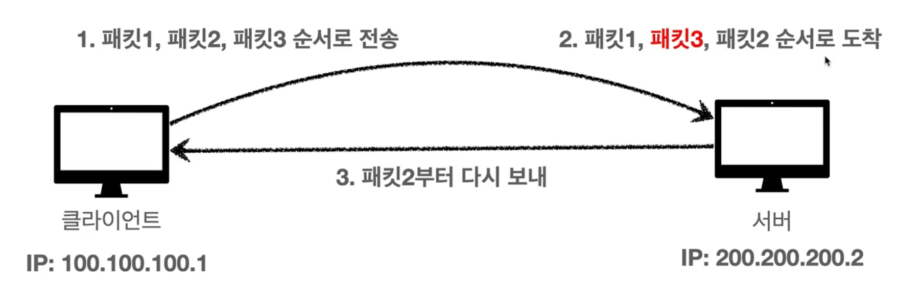

## 1. 인터넷 네트워크
### 1-1. 인터넷 통신
인터넷은 단순하지 않기 때문에 수많은 중간 노드(서버)를 거쳐서 넘어가야한다.
그럼 어떻게 넘어가는가 ?
### 1-2. IP(인터넷 프로토콜)
데이터를 전달할 목적지를 전달할 주소 : IP Address
패킷(Packet)이라는 통신 단위로 데이터를 전달한다
클라이언트 패킷을 전달하기 위해, 출발지 목적지 내용을 포함하여 던지면 노드들 끼리 정해진 프로토콜대로 목적지를 찾아간다.
**IP 프로토콜의 한계**
1. 비연결성 : 받을 대상이 없거나 서비스 불능 상태여도 패킷 전송
2. 비신뢰성 : 중간에 패킷이 사라지거나 순서대로 오지 않는다면?
3. 같은 IP를 사용하는 서버에서 통신하는 애플리케이션이 둘 이상이라면 어떻게 구분?
### 1-3. TCP, UDP

TCP : IP 프로토콜의 문제점들을 해결하는 것. IP의 위에있는 계층으로서 보완해줌

IP 패킷 정보 : 출발지 IP, 목적지 IP, 기타 등등
TCP 패킷 정보 : 출발지 PORT, 목적지 PORT, 전송제어정보, 순서정보, 검증 정보 등
  
**TCP(전송제어프로토콜)의 특징**
- 연결 지향 : 연결을 하고 메시지를 보냄 (3 way handshake)

SYN : 접속 요청 , ACK : 요청 수락. / 서버와 클라이언트가 서로 신뢰할 수 있게됨
- 데이터 전달을 보증함

- 순서를 보장함

  
**UDP(사용자 데이터그램 프로토콜) 특징**
- 연결지향 x, 데이터 전달 보증 x, 순서 보장 x, 단순하고 빠름
- IP와 거의 같으나 PORT, 체크섬 정도만 추가
- 애플리케이션에서 추가 작업이 필요하다
### 1-4. PORT
같은 IP에서 한번에 둘 이상을 연결해야 한다면? 포트를 사용한다.
IP 의 내부에서 애플리케이션을 확인하는 방법으로 포트를 사용한다.
패킷을 보낼때 출발지 포트, 도착지 포트를 명시하기때문에 출발포트 도착포트를 양쪽이 알고있다.
### 1-5. DNS
IP는 변경될 수 있다. 그러면 기존의 연결에서 접근을 못하게되지않나?
DNS (도메인 네임 시스템) : 도메인 명을 등록을 하고 IP 주소를 바꿀 수 있다.