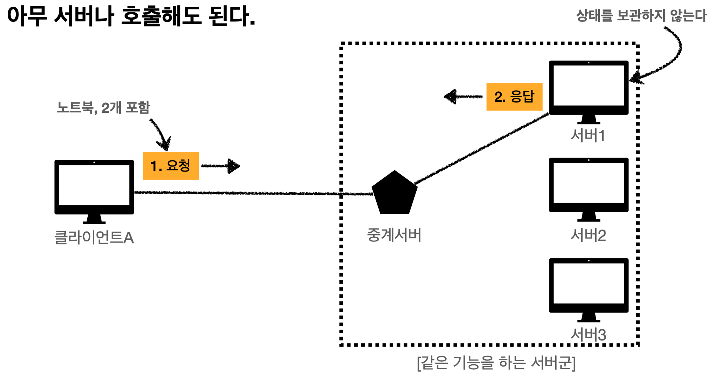
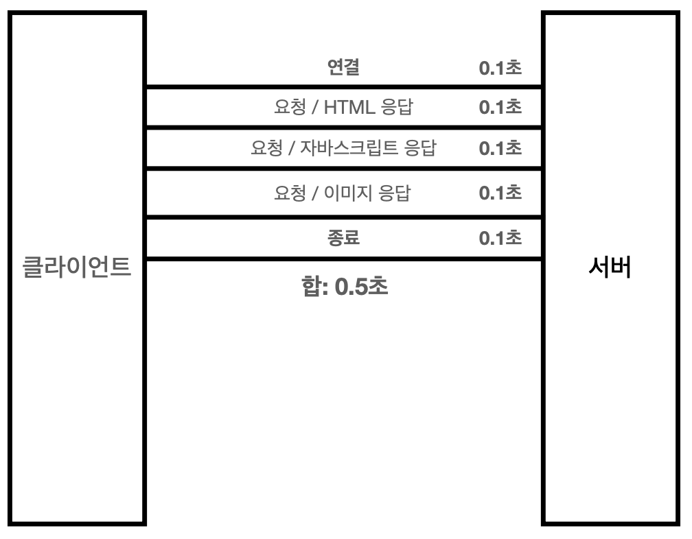

## 3. HTTP 기본
### 3-1. 클라이언트 서버 구조

클라이언트는 서버에 요청을 보내고, 응답을 대기한다.
서버는 요청에 대한 결과를 만들어서 응답한다.
비즈니스 로직, 데이터들을 서버에 다 밀어 넣어두고, 클라이언트는 UI와 사용성에 집중하도록 분리를 시킨다 → 매우중요. 각각이 따로따로 진화가 가능하기 때문
### 3-2. Stateful, Stateless
HTTP는 무상태 프로토콜을 유지한다. (Stateless)
→ 무상태는 응답 서버를 쉽게 바꿀 수 있다 = 무한한 서버 증설 가능

### 3-3. 비연결성 (conncectionless)
- HTTP는 기본이 연결을 유지하지 않는 모델이다.
- 일반적으로 초 단위의 이하의 빠른속도로 응답
그러나 이렇게 비연결 상태라면 항상 TCP/IP 연결을 새로 맺어야함 (3 way handshake)

→ 지금은 HTTP 지속 연결로 문제를 해결 (http 2, 3에서는 훨씬 개선되었음)

### 3-4. HTTP 메시지

→ 공백은 반드시 있어야 한다.
**시작라인 (요청 메시지)**
- 종류 (GET, POST, PUT, DELETE) 를 갖는다. 중요 !!
- 요청메시지의 요청 대상
- HTTP 버전
**시작라인 (응답 메시지)**
- HTTP 버전
- HTTP 상태 코드 ( 요청 성공, 실패를 나타내는 ) 중요 !!
- 이유 문구
**HTTP 헤더**
- http 전송에 필요한 모든 부가정보
**HTTP 메시지 바디**
- 실제 전송할 데이터
- html문서, 이미지, 영상, JSON 등등 byte로 표현할 수 있는 모든 데이터 전송 가능