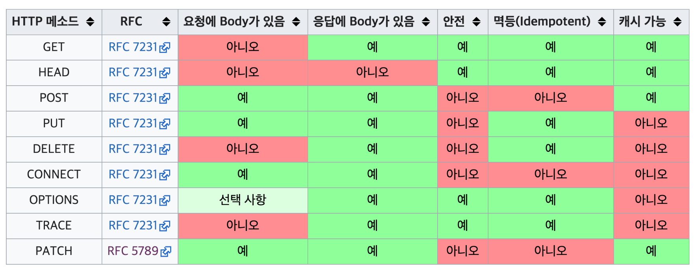

## 4. HTTP 메서드
### 4-1. HTTP API 만들기
URI 설계의 가장 중요한 것 : 리소스를 식별 (ex. 회원을 조회하는 기능에서 리소스는 회원)
(참고 : 계층 구조상 상위를 컬렉션으로 보고 복수단어 사용 권장)
URI에서는 리소스와 행위를 분리 시켜야한다. 행위를 메서드로 구분함
- GET: 리소스 조회
- POST: 요청 데이터 처리, 주로 등록
- PUT: 리소스를 대체, 해당 리소스가 없으면 생성
- PATCH: 리소스 부분 변경
- DELETE: 리소스 삭제
### 4-2. GET, POST
GET : 리소스 조회. 서버에 전달하고 싶은 데이터는 query를 통해서 전달
POST : 요청 데이터 처리, 메시지 바디를 통해서 서버로 요청 데이터 전달, 서버는 요청 데이터를 처리 (GET에서 조회데이터를 넘겨야하는데 GET 메서드를 사용하기 어려운 경우, 애매한 경우에도 사용을 한다.)
### 4-3. PUT, PATCH, DELETE
PUT : 리소스를 대체. 해당 리소스가 없으면 생성 (덮어버림), 클라이언트가 리소스를 알고 URI 를 지정한다.
PATCH : 리소스를 부분만 변경.
DELETE : 리소스를 제거
### 4-4. HTTP 메서드의 속성

**안전하다 의 개념** : 호출해도 리소스를 변경하지 않는다.
**멱등 의 개념** : 한번 호출하든 두번 호출하든 100번 호출하든 결과가 똑같다.
→ GET, PUT, DELETE는 멱등하고 POST는 그렇지 않다
→ ex ) 자동 복구 매커니즘. 서버가 요청을 처리했는지 몰라서 한번더 처리해야하는 경우 PUT쓰면되겠지?
**캐시가능하다 의 개념** : 응답 결과 리소스를 캐시해서 사용해도 되는가?
→ GET, HEAD, POST, PATCH는 캐시가능
→ 그러나 실제로는 GET, HEAD 정도만 캐시로 사용한다.