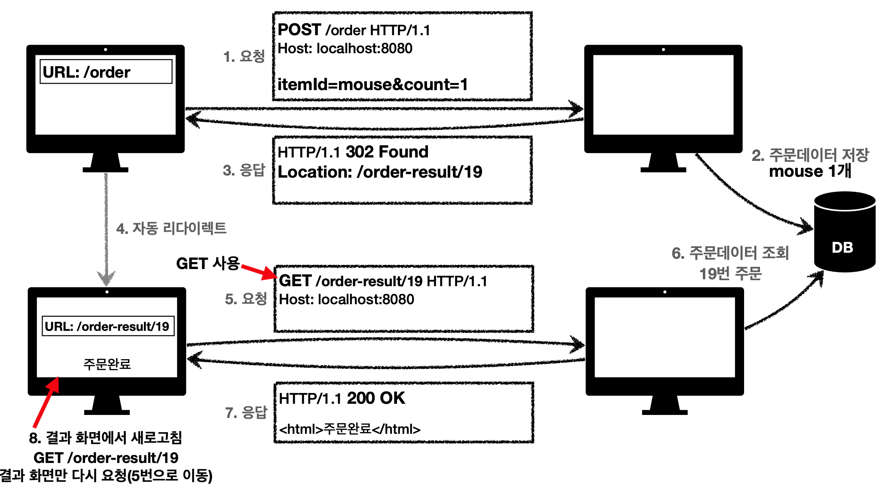

## 5. HTTP 상태코드
클라이언트가 보낸 요청의 처리 상태를 알려주는 것
### 5-1. 2xx : 성공
클라이언트가 보낸 요청이 잘 처리가 되었다. 팀내에서 어떤 코드를 쓸지 정해서 쓰는걸로 정의를 하는게 좋음.
- 200 : OK
- 201 : Created → 요청에 성공해서 새로운 리소스가 생성됨
    - 헤더에 Location이라는 필드를 넣어서 리소스의 위치를 확인
- 202 : Accepted → 요청이 접수되었으나 처리가 완료되지 않았음
    - 배치처리에서 주로 쓰고 잘 쓰지는 않음.
- 204 : No Content → 서버가 요청을 성공적으로 수행했지만, 본문에 보낼 데이터가 없음
    - 웹 문서 편집기의 save 버튼 = 결과로 아무 내용도 없고, 같은 화면을 유지해야한다.
### 5-2. 3xx : 리다이렉션
요청을 완료하기 위해 클라이언트의 추가 조치가 필요. 웹 브라우저는 3xx 응답의 결과에 Location 헤더가 있으면 Location 위치로 자동으로 이동 (리다이렉트)
- **영구 리다이렉션 - 특정 리소스의 URI가 영구적으로 이동**
    - 301 (Moved Permanently) : 요청 메서드가 GET으로 변하고 본문이 제거 “될 수 있음”
    - 308 (Permanent Redirect) : 요청 메서드와 본문 유지
- **일시 리다이렉션 - 일시적인 변경**
    - ex. 주문 완료 후 주문 내역화면으로 이동
    - 302 (Found) : 요청 메서드가 GET으로 변하고, 본문이 제거될 수 있음
    - 303 (See Other) : 요청 메서드가 GET으로 변경
    - 307 (Temporary Redirect) : 요청 메서드와 본문 유지
    - **PRG : Post/Redirect/Get**
        
        - POST로 주문 후에 웹 브라우저를 새로고침하면? 중복주문이 들어갈 수 있음 (새로고침은 다시 요청)
        - POST로 주문후에 주문 결과 화면을 GET 메서드로 리다이렉트 해버림 → 새로고침해도 결과화면을 GET으로 조회
        
        
        
- **특수 리다이렉션 - 결과 대신 캐시를 사용**
    - 304 (Not Modified) : 리소스가 수정되지 않았으니까 캐시를 써라
        - 로컬 캐시를 사용해야 하므로 메시지 바디를 포함하면 안된다.
### 5-3. 4xx : 클라이언트 오류, 5xx : 서버오류
4xx 오류는 똑같이 재시도를 해도 똑같이 발생
- 400(Bad Request) : 클라이언트는 요청 내용을 다시 검토하고 보내야 함
- 401(Unauthorized) : 클라이언트가 해당 리소스에 대한 인증이 필요함
    - WWW-Authenticate 헤더와 함께 인증 방법을 설명해야됨
- 403(Forbidden) : 서버가 요청을 이해했지만 승인을 거부함
    - 인증 자격 증명은 있지만, 접근 권한이 불충분한 경우
- 404(Not Found) : 요청 리소스를 찾을 수 없음. 또는 클라이언트가 권한이 부족한 리소스에 접근할 때 해당 리소스를 숨기고 싶은 경우
5xx 오류는 똑같이 재시도를 해도 성공할 가능성이 있음.
- 500(Internal Server Error) : 애매하면 500으로 던짐
- 503(Service Unavailable) : 일시적으로 서비스 이용 불가 (패치작업 같은경우)
→ 왠만하면 서버에 문제가 터졌을 때 5xx 에러를 만들어야하고 진짜 서버에 문제가 생겨야 만드는거임 . 모니터링 툴에서도 5xx는 매우 심각하게 받아들임