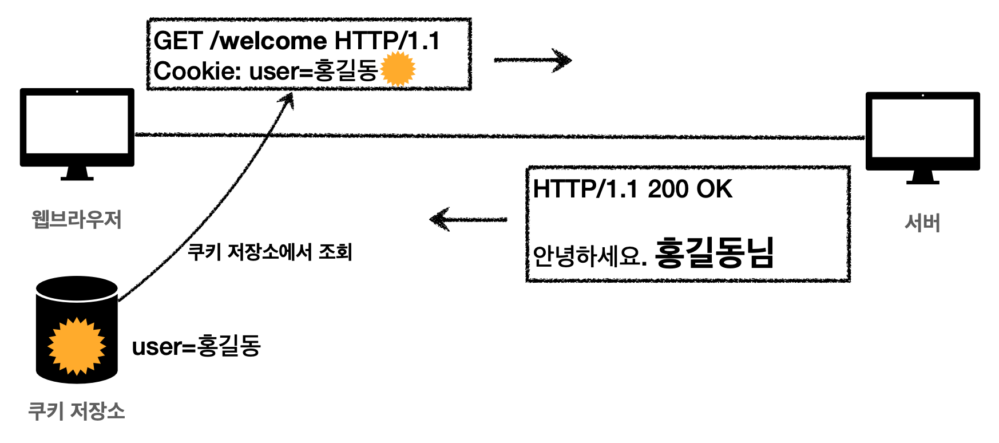

## 6. HTTP 일반 헤더
### 6-1. 표현
- Content-Type : 표현 데이터의 형식 ex) JSON, html, …
- Content-Encoding : 표현 데이터의 압축 방식 ex) UTF-8
- Content-Language : 표현 데이터의 자연언어 ex) ko, en, en-US
- Content-Length : 표현 데이터의 길이
### 6-2.협상(Content Negotiation)
클라이언트가 선호하는 표현 요청
- Accept : 클라이언트가 선호하는 미디어 타입 전달
- Accept-Charset: 클라이언트가 선호하는 문자 인코딩
- Accept-Encoding: 클라이언트가 선호하는 압축 인코딩
- Accept-Language: 클라이언트가 선호하는 자연언어
### 6-3. 중요 헤더들
- Host : 요청한 호스트 정보 (도메인)
    - 필수로 헤더에 포함되어야 하는 정보다.
    - 요청에서 사용된다.
    - 하나의 서버가 여러 도메인을 처리해야할때, 하나의 IP 주소에 여러 도메인이 적용되어있을때 사용된다.
- Allow : 허용 가능한 HTTP 메서드
    - 405 (Method Not Allowed) 에서 응답에 포함해야함.
    - 서버에 별로 구분안되있음
- Retry-After : 클라이언트가 다음 요청을 하기까지 기다려야 하는 시간
    - 503 에러에서 사용한다.
### 6-4. 인증
- Authorization : 클라이언트 인증 정보를 서버에 전달
    - 인증 메커니즘에 따라 어떤 값이 들어가는지 아예 다름
- WWW-Authenticate : 리소스 접근 시 필요한 인증 방법 정의
    - 401 Unauthorized 응답과 함께 사용
### 6-5. 쿠키

- Set-Cookie : 쿠키 설정
- Cookie : 쿠키 정보를 담아서 전달
쿠키는 사용자 로그인 세션관리와 광고정보 트래킹에 주로 사용된다.
→ 항상 서버로 전송되기 때문에, 네트워크 트래픽이 추가로 유발될 수 있으므로 최소한의 정보만 사용해야한다. → 서버에 전송하기 싫으면 웹 스토리지 참고
  
**쿠키의 생명주기**
- 만료일이 되면 쿠키 삭제 (생략하면 브라우저 종료시 까지만 유지 : 세션쿠키)
- 0이나 음수를 지정하면 쿠키 삭제
**쿠키의 도메인 지정 (domain)**
- 명시 : 해당 도메인 + 서브 도메인에서 쿠키 접근 가능
- 명시안함 : 해당 도메인에서만 쿠키 접근 가능
**쿠키의 경로 (path)**
- 이 경로를 포함한 하위 경로 페이지만 쿠키 접근
- 일반적으로 루트로 지정
**쿠키 보안 (Secure, HttpOnly, SameSite)**
- Secure - https 인 경우에만 전송
- HttpOnly - 자바스크립트에서 접근 불가 , Http 전송에만 사용
- SameSite : 요청 도메인과 쿠키에 설정된 도메인이 같은 경우에만 쿠키 전송