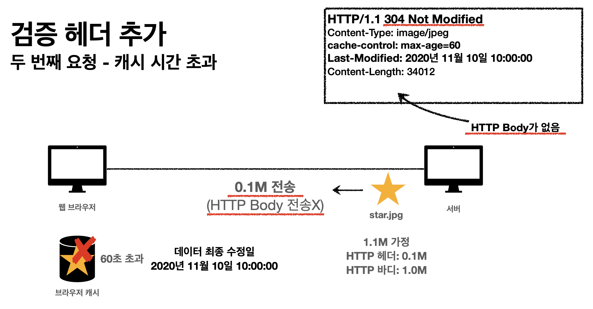

## 7. 웹 캐시(Cache)
캐시를 사용하지 않을 때는 데이터가 변경되지 않더라도, 계속 네트워크를 통해서 데이터를 다운로드 받아야한다.
캐시를 사용하면 가능 시간 동안 네트워크를 사용할 필요가 없고, 빠른 사용자 경험을 할 수 있다.
### 7-1. 검증 헤더와 조건부 요청
캐시 유효 시간이 초과해서 서버에 다시 요청하면 2가지 상황이있다.
1. 값이 변경된 경우 → 무조건 서버에서 다시 받아와야된다.
2. 값이 변경되지 않은 경우 → 검증헤더를 포함한 GET 요청을 통해 조건부 요청을 해야한다.

Last-Modified : 서버에서 최종 변경된 기능들을 갖는다.

만약 변동되지 않았다면 http 304와 함께, HTTP 헤더만 반환된다 (네트워크가 절약된다)
- 캐시 유효 시간이 초과해도, 서버의 데이터가 갱신되지 않으면 304 Not Modified + 바디없는 응답이 반환됨.
- 실용적인 해결책

ETag 를 사용하여서 비교 검증을 한다면 더 효율적이다.

- 진짜 ETag만 서버에 보내서 같으면 유지, 다르면 다시 받는 방법이다.
- 캐시 제어 로직을 서버에서 완전히 분리한다는 점에서 효율적이다.
### 7-2. Cache Control
- Cache-Control: max-age → 캐시 유효시간 설정 (초단위)
- Cache-Control: no-cache → 데이터는 캐시해도 되지만 항상 원 서버에 검증하고 사용
- Cache-Control: no-store → 데이터에 민감한 정보가 있으므로 저장하면 안됨
- Pragma : no-cache → 구형 브라우저에도 사용가능한 것
- Expires → 구형 브라우저에도 사용가능한 것
### 7-3. Proxy Cache
글로벌 웹 서비스에서 지구 반대편으로 http 요청하기엔 시간이 오래걸리므로 proxy 캐시를 가지고 시간을 단축한다.

### 7-4. 캐시 무효화
- **Cache-Control: no-cache**
    - 데이터는 캐시해도 되지만, 항상 **원 서버에 검증**하고 사용(이름에 주의!)
- **Cache-Control: no-store**
    - 데이터에 민감한 정보가 있으므로 저장하면 안됨 (메모리에서 사용하고 최대한 빨리 삭제)
- **Cache-Control: must-revalidate**
    - 캐시 만료후 최초 조회시 **원 서버에 검증**해야함
    - 원 서버 접근 실패시 반드시 오류가 발생해야함 - 504(Gateway Timeout)
    - must-revalidate는 캐시 유효 시간이라면 캐시를 사용함

