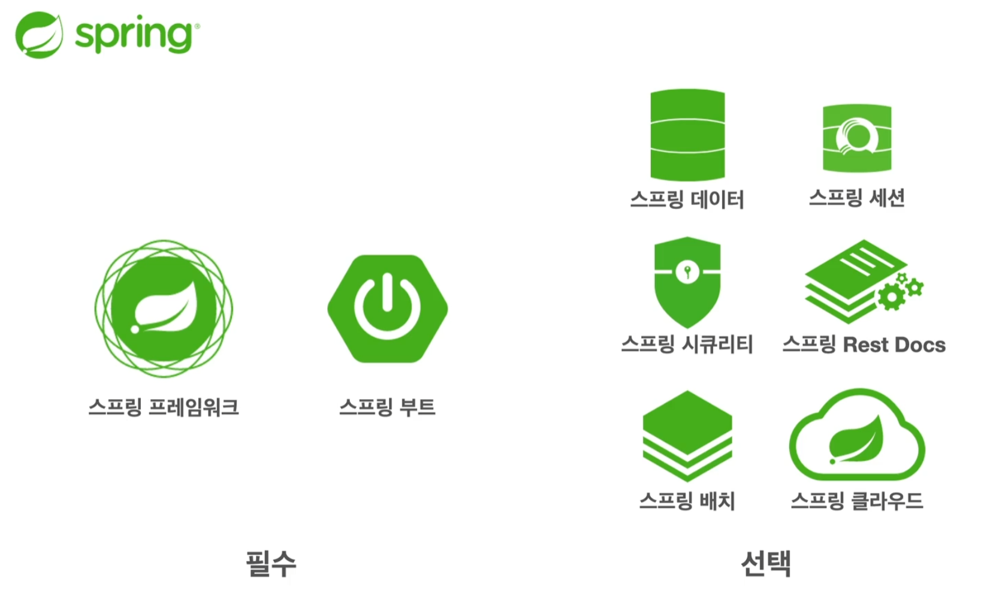
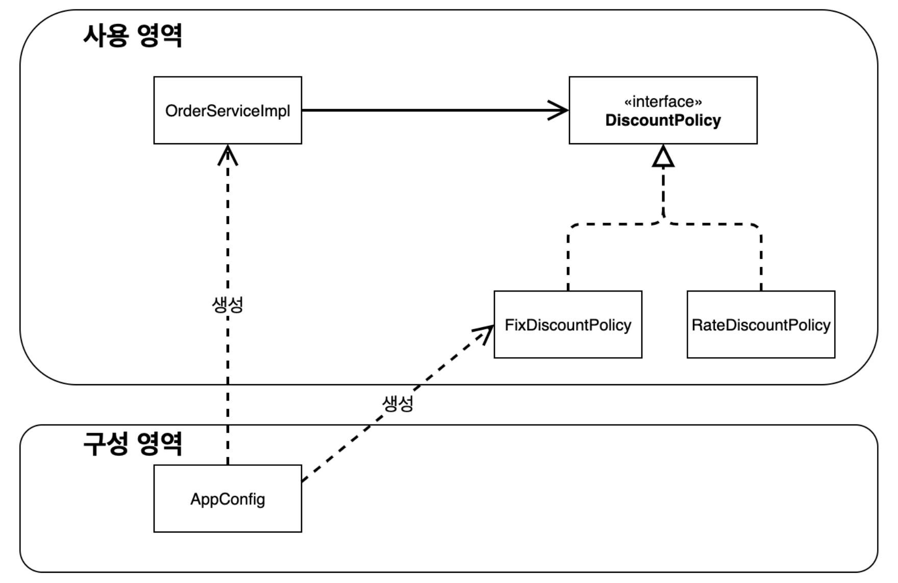

## 1. 객체 지향 설계와 스프링
### 1-1. 스프링이란?

**스프링 프레임워크** - 스프링의 핵심 기술을 포함하는 프레임워크
**스프링 부트** - 스프링의 설정을 편하게 해주는 프레임워크
스프링은 자바 언어기반의 프레임워크 + 자바 언어의 가장 큰 특징 “객체지향” → 객체 지향 언어가 가진 특징을 살려내는 프레임워크
**객체지향 프로그래밍의 장점**
- 역할과 구현으로 구분하면 단순해지고 유연해지며 변경이 편리하다.
    - 클라이언트는 인터페이스만 알면된다.
    - 클라이언트는 내부구조를 몰라도 되고 변경되어도 영향을 받지않는다.
**스프링과 객체 지향**
- 다형성이 가장 중요하다. 스프링은 이걸 극대화 시킴.
- 제어의 역전 (IoC), 의존관계 주입(DI) 등을 제공함.
### **1-2. 좋은 객체 지향 설계의 5가지 원칙(SOLID)**
- SRP 단일 책임 원칙
    - 하나의 클래스는 하나의 책임만 가져야한다.
    - 하나의 책임이라는 것은 모호하다 → 중요한 기준은 변경이
        - 변경이 있을 때 파급 효과가 적으면 단일 책임 원칙을 잘 따른 것
- OCP 개방-폐쇄 원칙
    
    - 소프트웨어 요소는 확장에는 열려있으나 변경에는 닫혀있어야한다.
    - 인터페이스를 구현한 새로운 클래스를 만드는 것은, 기존의 코드를 변경하는게 아니다 !! ==← 이걸 지향하자.==
    - 근데 그럼 클라이언트에서 어쨋든 새로 짠 클래스를 선택(새로운 구현체로 변경)해야되니까 코드 변경이 있지않냐?
    
    → 객체를 생성하고, 연관관계를 맺어주는 설정자가 필요 : spring이 제공한다 (spring container)
    
- LSP 리스코프 치환 원칙
    - 다형성에서 하위 클래스는 인터페이스가 세운 원칙을 따라야한다.
- ISP 인터페이스 분리 원칙
    - 특정 클라이언트를 위한 여러개의 인터페이스가 범용 인터페이스 하나보다 낫다.
- DIP 의존관계 역전 원칙
    - 프로그래머는 “추상화에 의존해야지, 구체화에 의존하면 안된다” == 구현 클래스에 의존하지 말고 인터페이스에 의존해라
    - 클라이언트가 구현 클래스를 선택하는 방식은 ==**DIP를 위반**==하는 것이다.
  
궁극적으로는 모두 인터페이스를 도입하는게 좋지만, 추상화라는 비용이 발생한다.
→ 기능이 확장할 가능성이 없다면 바로 구체 클래스를 개발하고, 향후 꼭 필요할 때 리펙터링해서 도입하는 것도 방법이다.
### 1-3. SOLID 원칙의 적용 및 객체지향 프로그래밍
만약 기획 or 개발이 변경되어서 같은 인터페이스지만 구현체를 변경해야 한다면 다음과 같이 할 수 있다.
```Java
// private final DiscountPolicy discountPolicy = new FixDiscountPolicy();
private final DiscountPolicy discountPolicy = new RateDiscountPolicy();
```
이런 프로그래밍은 결국 DIP 원칙과 OCP 원칙이 깨지는 계기가 됨.
→ ==DIP가 깨진 이유== : 추상화 (인터페이스)에도 의존하지만 구현체 (클래스)에도 의존하고 있음
→ ==OCP가 깨진 이유== : Service의 기능이 바뀐게 아닌데 코드를 수정해야됨. 새로운 구현체를 주입하기때문에
따라서 이런 경우에는 인터페이스에만 의존하도록 코드를 변경해줘야 하며, 누군가 객체를 만들어서 기존클래스에 주입해줘야한다.
**🌟 문제해결 방법**
`**AppConfig.java**` 파일을 만들어서 각 인터페이스에서 어떤 구현체를 사용하는지를 지정해주자.
```Java
public class AppConfig {
    public MemberService memberService() {
        return new MemberServiceImpl(memberRepository());
    }
    private static MemoryMemberRepository memberRepository() {
        return new MemoryMemberRepository();
    }
    public OrderService orderService() {
        return new OrderServiceImpl(memberRepository(), DiscountPolicy());
    }
    private static DiscountPolicy DiscountPolicy() {
        return new FixDiscountPolicy();
    }
}
```
→ 이런식으로 `AppConfig.java`에서는 인터페이스가 어떤 구조체를 사용하는지 보기 쉽게 나타내야한다.
→ 기존 `new` 키워드로 할당해주던 부분을 생성자를 통해 할당받도록 수정하고, 호출할 때 `AppConfig` 클래스의 메서드를 사용한다.
```Java
public static void main(String[] args) {
	AppConfig appConfig = new AppConfig();
	MemberService memberService = appConfig.memberService();
	// ...
}
```
```Java
public class MemberServiceImpl implements MemberService{
  private final MemberRepository memberRepository;
  public MemberServiceImpl(MemberRepository memberRepository) {
      this.memberRepository = memberRepository;
  }
	//...
}
```
→ 테스트 코드도 @BeforeEach 어노테이션을 통해 각 테스트 수행 전에 AppConfig를 통한 객체 주입을 받아야한다.
```Java
public class MemberServiceTest {
  MemberService memberService;
  @BeforeEach
  public void beforeEach() {
      AppConfig appConfig = new AppConfig();
      memberService = appConfig.memberService();
  }
	// ... 테스트코드
}
```
==**이렇게 전체 프로그램의 구성을 AppConfig에 모두 위임하는 것이 매우 매우 중요하다**==
