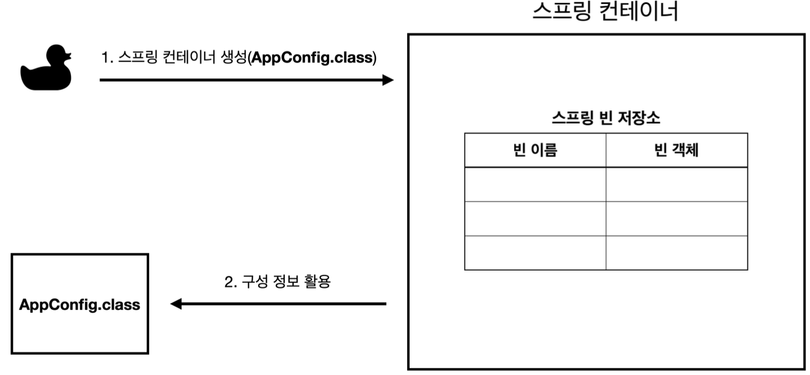
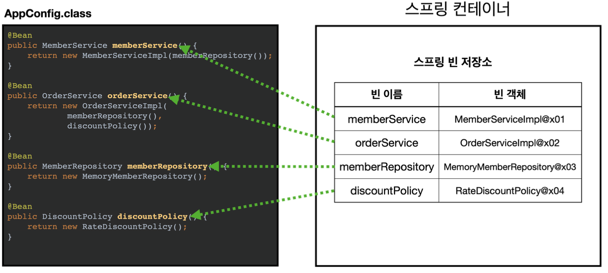
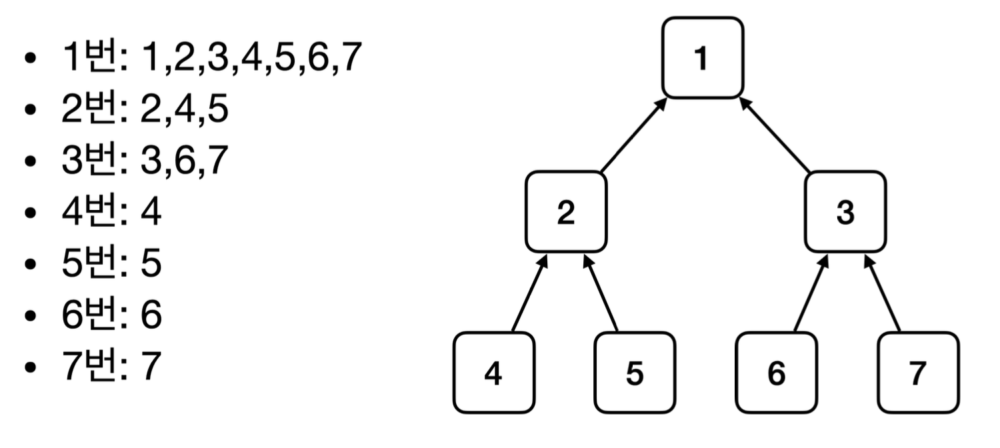
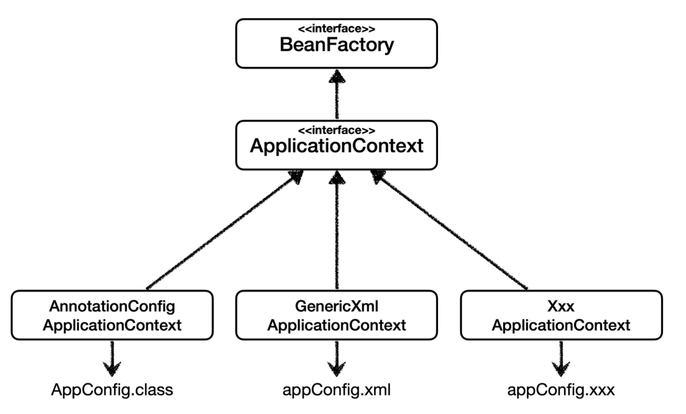
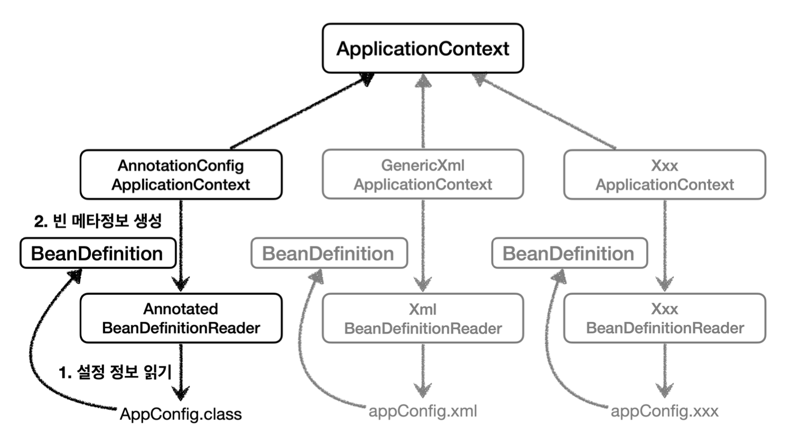

## 2. 스프링 컨테이너와 스프링 빈
### 2-1. 스프링 컨테이너 생성 및 스프링 빈 등록
```Java
ApplicationContext ac = new AnnotationConfigApplicationContext(AppConfig.class);
```
→ ApplicationContext를 **스프링 컨테이너**라고 하며 인터페이스이다.

스프링 컨테이너 내부에 빈 저장소가 있다.

코드에서는 @Bean 으로 직접 등록해줄 수 있다.
→ 빈 이름은 메서드 이름을 관례적으로 사용하며, 직접 부여할 수도 있다. ( `@Bean(name=”beanName”)` )
→ 빈의 이름은 항상 다른 이름을 부여해야한다. 같은 이름을 부여하면 다른 빈이 무시되거나 기존 빈을 덮어버리는 불상사가 발생
### 2-2. 상속관계에서 스프링 빈 조회하기

> [!important]  
> 부모로 조회하면 자식 타입들은 반드시 조회된다.뒤에서도 이 내용은 사용되므로 알고 넘어가기!!  

→ 이런 구조이기 때문에 Object 타입으로 조회하면 모든 스프링 빈이 조회된다.
### 2-3. BeanFactory와 ApplicationContext
- `**BeanFactory**`는 스프링 컨테이너의 최상위 인터페이스이며 스프링 빈을 관리하고 조회하는 역할을 담당한다.
- `**ApplicationContext**`는 `BeanFactory`의 기능을 모두 상속 받고 수많은 부가 기능들을 제공해준다
    - 메시지소스를 활용한 국제화기능
    - 환경변수 설정
    - 애플리케이션 이벤트
    - 편리한 리소스 조회

또한 ApplicationContext는 다양한 구현체들을 갖고있어 스프링 프로젝트가 유연한 설정이 가능하도록 한다.
### 2-4. BeanDefinition

스프링은 다양한 설정 형식을 지원하기 위해 `**BeanDefinition**` 이라는 추상화 개념을 가지고있다.
- `BeanDefinition` : 빈 설정 메타 정보
- `@Bean`, `<bean>` 당 각각 하나씩 메타 정보가 생성된다.
- 직접 생성해서 스프링 컨테이너에 등록할 수 있지만 실무에서 그럴일은 거의 없다.
