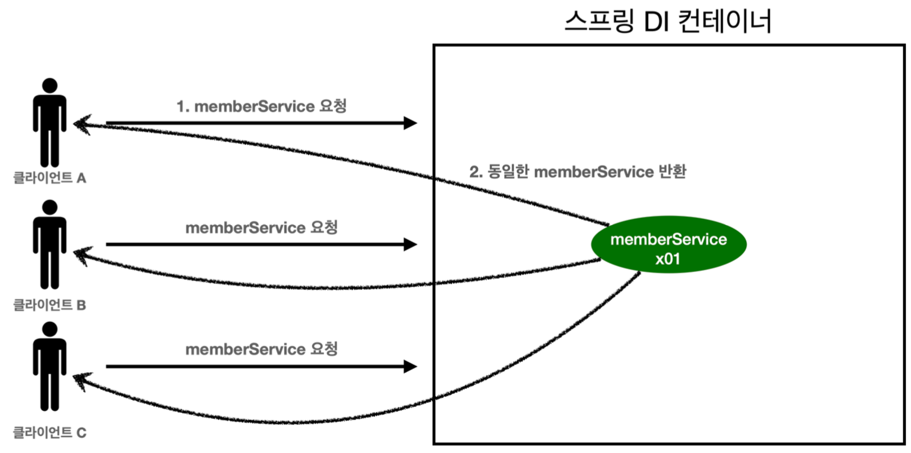
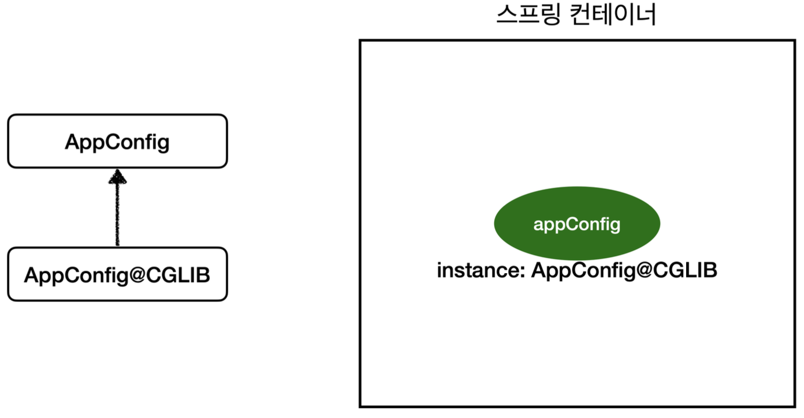
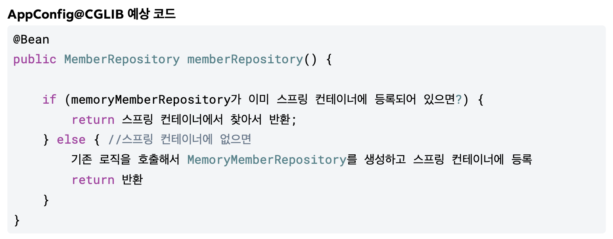

## 3. 싱글톤 컨테이너
### 3-1. 싱글톤
대부분의 스프링 애플리케이션은 웹 애플리케이션이며, 보통 여러 고객이 동시에 요청을 한다.
이때 TPS가 100이면, 초당 100개의 객체가 생성되고 소멸되어야 한다 → 메모리 낭비가 심하다. 해결방안은 해당 객체가 딱 1개만 생성되고 공유되도록 한다. (==싱글톤 패턴==)
JAVA에서 싱글톤 패턴은 다음과 같이 적용할 수 있다.
```Java
public class SingletonService {
	//1. static 영역에 객체를 딱 1개만 생성해둔다.
	private static final SingletonService instance = new SingletonService();
	
	//2. public으로 열어서 객체 인스턴스가 필요하면 이 static 메서드를 통해서만 조회하도록 허용한다.
	     public static SingletonService getInstance() {
	         return instance;
	}
	
	//3. 생성자를 private으로 선언해서 외부에서 new 키워드를 사용한 객체 생성을 못하게 막는다. 
	private SingletonService() { }
	
}
```
그러나 싱글톤 패턴은 다음과 같은 문제점이 있다.
- 구현하는데 코드가 많이 필요하다.
- 클라이언트가 구체 클래스에 의존한다 → DIP를 위반하며 OCP원칙을 위반할 가능성이 높다.
- 테스트하기 어렵다
- 내부 속성을 변경하거나 초기화하기 어렵다
- private 생성자로 자식클래스를 만들기 어렵다
- 유연성이 떨어진다
### 3-2. 스프링 싱글톤 컨테이너
스프링 컨테이너는 싱글턴 패턴을 적용하지 않아도 객체 인스턴스를 싱글톤으로 관리한다.
- 싱글톤 패턴 구현을 위한 지저분한 코드가 들어가지 않아도된다.
- DIP, OCP, 테스트, private 생성자 등 문제점으로 부터 자유롭게 싱글톤을 사용할 수 있다.


> [!important]  
> 싱글톤 객체는 상태를 유지하게 설계하면안된다 !! stateful 말고 stateless (무상태)로 해야됨!- 특정 클라이언트에게 의존적이면 안된다.- 특정 클라이언트가 값을 변경할 수 있는 필드가 있으면 안된다.- 가급적 읽기만 가능해야된다.  
### 3-3. @Configuration 과 바이트코드 조작
AppConfig 클래스에는 `@Configuration` 를 붙여서 설정정보라는것을 알게 해주었다.
AppConfig.class 정보를 출력해보면 다음과 같이 나온다 → `bean = class hello.core.AppConfig$$EnhancerBySpring``**CGLIB**``$$bd479d70`
여기서 주목해야될건 CGLIB인데, 스프링이 Bean으로 등록할 때 AppConfig 클래스를 CGLIB으로 임의의 다른 클래스로 만들고 그 다른 클래스를 스프링 빈으로 등록한 것이다.


이 절차는 스프링 애플리케이션이 시작될 때 모든 클래스들이 Bean으로 등록되면서 거치는 절차이다.
이 절차를 통해 싱글턴 패턴이 보장되는 것이다.
