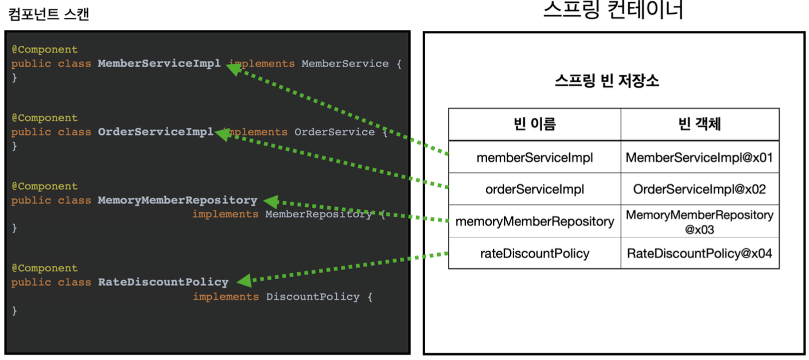
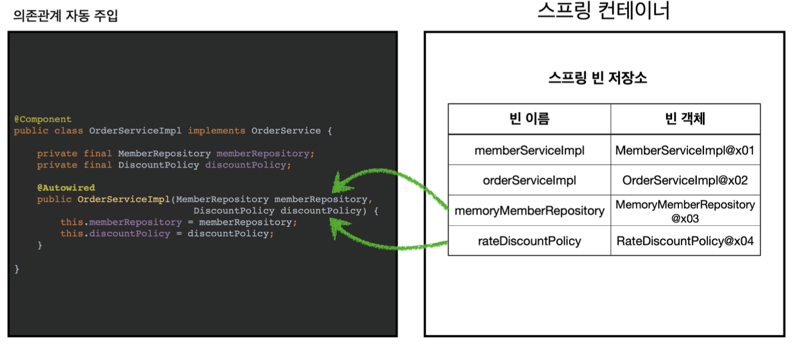
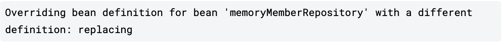

## 4. 컴포넌트 스캔
실무에서는 등록해야할 스프링 빈이 수십, 수백개가 되어 일일이 등록하기도 귀찮고 설정정보도 커지고 누락하는 문제도 발생한다.
→ 스프링은 설정 정보가 없어도 자동으로 스프링 빈을 등록하는 **컴포넌트 스캔**이라는 기능을 제공한다.
→ 또한 의존관계를 자동으로 주입하는 `@Autowired` 라는 어노테이션을 제공한다.
  
컴포넌트를 명시할 때는 다음 어노테이션을 클래스에 붙여주면된다. (Component가 아닌것은 Component를 내장하고 있다)
- `@Component` : 컴포넌트 스캔에서 사용
- `@Controller` : 스프링 MVC 컨트롤러
- `@Service` : 스프링 비즈니스 로직
- `@Repository` : 스프링 데이터 접근 계층
- `@Configuration` : 스프링 설정 정보에서 사용
```Java
@Component
public class MemoryMemberRepository implements MemberRepository { }
```
또한 생성자에서 의존관계 주입이 필요하다면 `@Autowired` 어노테이션을 사용한다
```Java
@Component
public class MemberServiceImpl implements MemberService {
 
   private final MemberRepository memberRepository;
   
   @Autowired
   public MemberServiceImpl(MemberRepository memberRepository) {
       this.memberRepository = memberRepository;
   }
   
}
```

> [!important]  
> 사실 어노테이션에는 상속관계라는 것은 없다. 어노테이션이 특정 어노테이션을 들고 있는 것을 인식할 수 있는 것은 스프링이 지원하는 기능이다. (java가 지원하는 기능이 아니다)  

- 컴포넌트 스캔에서 스프링 빈의 기본 이름은 클래스명을 사용하되 맨 앞글자만 소문자를 사용한다.

- 생성자에 Autowired 를 지정하면 스프링 컨테이너가 자동으로 해당 스프링 빈을 찾아서 주입한다.
- 이때 기본 조회 전략은 **타입이 같은 빈**을 찾아서 주입한다.
  
컴포넌트 탐색 위치 : **스프링 부트를 사용**하면 스프링 부트의 대표 시작 정보인 `**@SpringBootApplication**` 를 이 프로젝트 시작 루트에 두는 것이 관례이다.
  
**빈 등록 중복**
만약 같은 이름의 두 개의 빈 등록이 충돌한다면 반드시 오류가 발생한다.
**수동 빈 등록 vs 자동 빈 등록**
수동 빈 등록이 우선권을 갖는다. (자동 빈을 오버라이딩 해버린다.)

→ 이 문제는 찾기 힘든 어려운 버그로 이어지기 때문에 최근 스프링 부트는 수동과 자동이 충돌 할 경우에도 오류가 발생하도록 바꾸었다.
