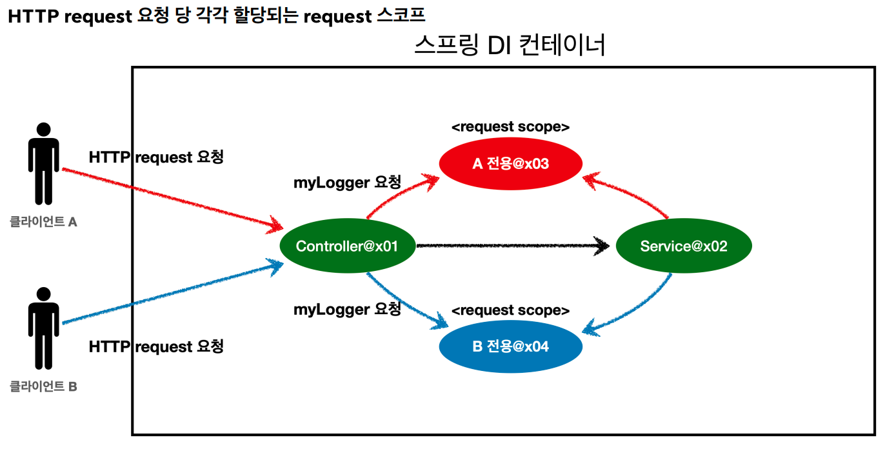
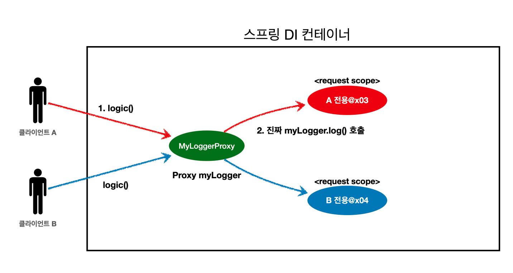

## 7. 빈 스코프 (Singleton, Prototype, Web-request)
빈 스코프란 빈이 존재할 수 있는 범위를 뜻한다.
- 싱글톤 : 기본스코프, 스프링 컨테이너의 시작과 종료까지 유지되는 가장 넓은 범위의 스코프
- 프로토타입 : 스프링 컨테이너가 프로토타입 빈의 생성과 의존관계 주입까지만 관여하는 매우 짧은 범위의 스코프
- 웹 스코프 : 웹 서버에서 사용되는 스코프
    - request : 웹 요청이 들어오고 나갈 때까지 유지되는 스코프
    - session : 웹 세션이 생성되고 종료될 때까지 유지되는 스코프
    - application : 웹의 서블릿 컨텍스트와 같은 범위로 유지되는 스코프
### 7-1. 프로토타입 스코프
스프링 컨테이너가 빈을 생성하고, 의존관계 주입 & 초기화까지만 처리하는 스코프. 클라이언트에 빈이 반환되고 이후 관리하지 않는다. (`@PreDestroy`같은 종료 메서드가 호출되지 않는다.)
빈 스코프는 `**@Scope**` 어노테이션을 통해 할 수 있다.
```Java
@Scope("prototype")
static class PrototypeBean {
	
	@PostConstruct
	public void init() {
		System.out.println("PrototypeBean.init");
	}
	
	@PreDestroy
	public void destroy() {
		System.out.println("PrototypeBean.destroy");
	}
}
```
싱글톤 빈에서 프로토타입 요청을 여러번 하게되면, 이미 과거에 주입이 끝난 상태기에, 사용할 때 마다 새로 생성되지 않는다
→ 이 문제를 해결하기위해 Provider를 사용한다.
### 7.2 싱글톤 스코프 + 프로토타입 스코프에서 Provider를 사용
1. `**ObjectFactory**`, `**ObjectProvider**`
    
    `ObjectProvider`는 `ObjectFactory`로부터 상속받아 만들어진 클래스이다.
    
    ```Java
    @Autowired
    private ObjectProvider<PrototypeBean> prototypeBeanProvider;
    
    public int logic(){
    	PrototypeBean prototypeBean = prototypeBeanProvider.getObject();
    	prototypeBean.addCount();
    	return prototypeBean.getCount();
    }
    ```
    
    - `prototypeBeanProvider.getObject()` 를 통해서 새로운 프로토타입 빈이 생성
    - 별도의 라이브러리는 필요없지만 스프링에 의존한다.
    - `ObjectProvider`는 상속, 옵션 스트림 처리 등 편의기능이 많다
2. **JSR-330** `**Provider**`
    
    `javax.inject.Provider` 라는 JSR-330 자바 표준을 사용하는 방법이다.
    
    스프링 부트는 `jakarta.inject.Provider` 를 사용한다.
    
    → gradle에 추가하면 된다.
    
    ```Java
    @Autowired
    private Provider<PrototypeBean> provider;
    
    public int logic() {
    	PrototypeBean prototypeBean = provider.get();
    	prototypeBean.addCount();
    	int count = prototypeBean.getCount();
    	return count;
    }
    ```
    
    - get() 메서드 하나로 기능이 매우 단순하다.
    - 별도의 라이브러리가 필요하다 (Gradle)
    - 자바 표준이므로 스프링이 아닌 다른 컨테이너에서도 사용할 수 있다.
### 7-3. 웹 스코프
웹 환경에서만 동작하며, 스프링 컨테이너가 해당 스코프의 종료시점까지 관리한다 → 따라서 종료 메서드가 호출된다.

- Request 스코프 예제
```Java
@Component
@Scope(value = "request")
public class MyLogger {
	private String uuid;
	private String requestURL;
	
	public void setRequestURL(String requestURL) {
		this.requestURL = requestURL;
	}
	
	public void log(String message){
		System.out.println( "내용" );
	}
	
	@PostConstruct
	public void init() {
		uuid = UUID.randomUUID.toString();
		System.out.println("내용");
	}
	
	@PreDestroy
	public void close() { 
		System.out.println("내용");
	}
```
→ 이 클래스를 비즈니스 로직에 적용하면 에러가 발생한다.
이유 : request 스코프는 실제로 request 요청이 있어야하는데, 애플리케이션 시작단계에서 임의로 스프링빈으로 등록하려 하면 만들어지지 않는다.

> 여기서 프록시를 적용해 주면 문제가 해결된다.
```Java
@Component
@Scope(value = "request", proxyMode = ScopedProxyMode.TARGET_CLASS)
public class MyLogger {
	// 내용은 같음
}
```

프록시에서는 CGLIB이라는 라이브러리로 클래스를 상속받은 가짜 프록시 객체를 만들어 주입한다. (스프링 컨테이너에 부팅시에 잘 적용된다)
프록시를 등록해두면 이렇게 가짜 프록시를 만들어서 지연처리를 해두고 요청이 들어오면 진짜 빈을 요청하는 로직이 들어있다.