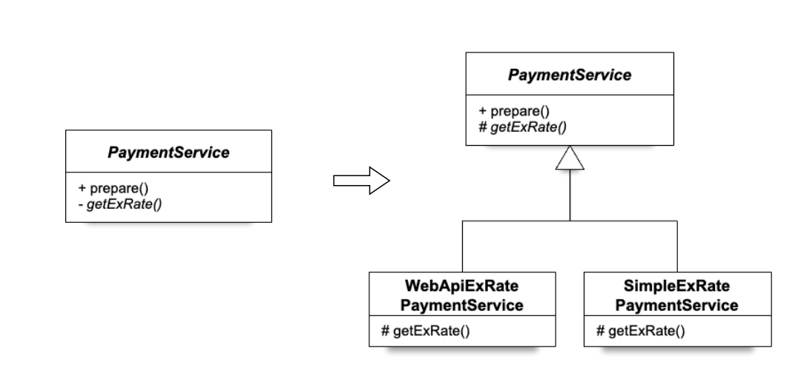
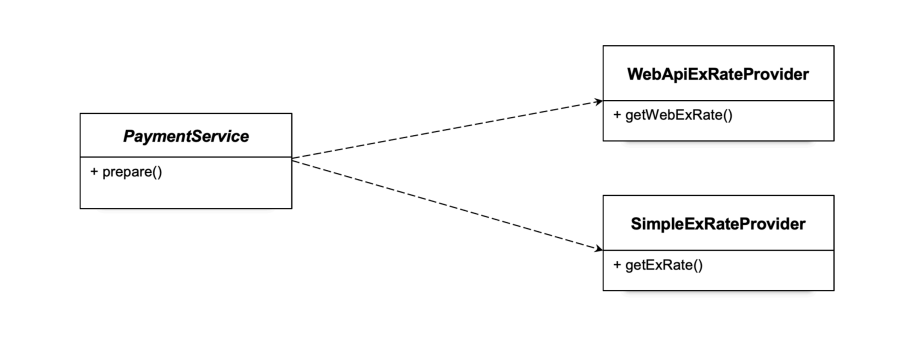
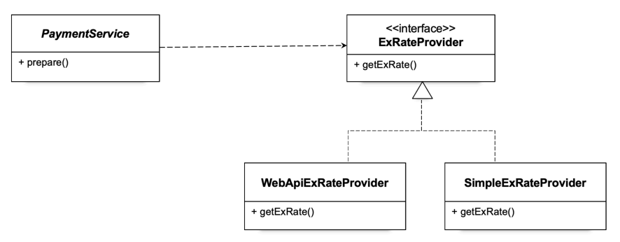
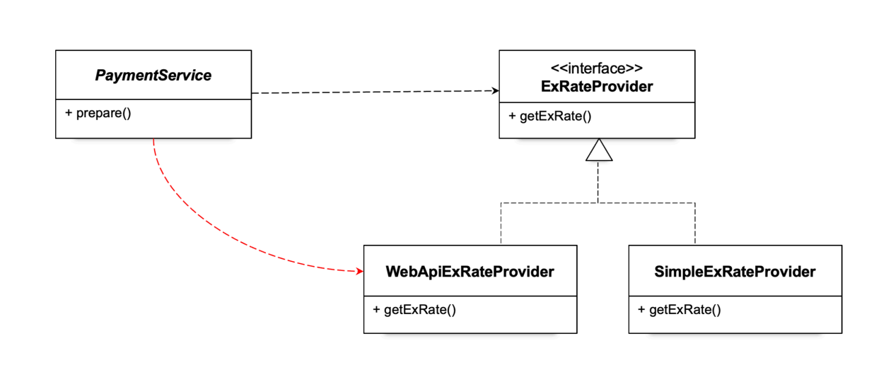
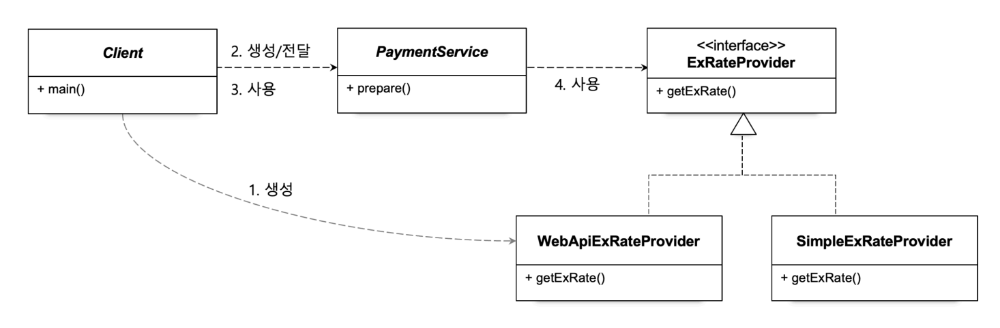
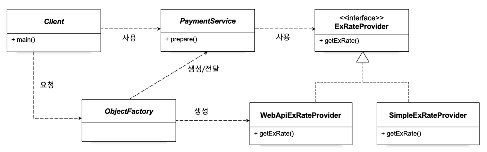

> 한 개의 메서드는 하나의 역할(관심사)를 갖는 것이 중요하다. 

이는 코드의 유지 보수성을 높여준다. 관심사를 분리하기 위한 다양한 방법이 존재한다.
### 클래스 상속을 통한 확장

> 이런식으로 기능을 확장하게 되면 유지보수성이 높아진다.

- 상속을 통해 확장하는 것은 좋지만, 이는 명확한 한계를 가지고있다.
	- 상속을 통해 확장하게되면, 추가로 확장을 하는 경우에 코드의 수정이 너무 많아진다.
	- 이름이 너무 복잡해서 가독성이 낮아진다. 보통 상속이나 구현체에는 상위 클래스/인터페이스의 이름을 따서 만들기 때문

### 클래스의 분리를 통한 확장

이런 구조로 변경하게되면, 코드는 더 이상 확장에 어려움이 사라지고 단순해진다.
이런식으로 변경하게되면, PaymentService는 분리된 클래스에 대해 의존관계를 갖는다고 표현한다.

이 방식의 가장 큰 단점은 클래스를 갈아끼울 때 코드의 수정이 너무 많이 일어난다는 것이다.
```java
private final WebApiExRateProvider exRateProvider;  
  
public PaymentService() {  
    this.exRateProvider = new WebApiExRateProvider();  
}
```
의존관계를 갖는 `PaymentService`의 코드 또한 수정이 2곳이나 필요하다. 
즉 확장성에 유리한 코드는 아니라는 뜻이다.
### 인터페이스 도입

인터페이스를 사용하면 클래스를 생성하는 부분만 수정하면 된다.
```java
private final ExChangeRateProvider exRateProvider;

public PaymentService() {  
    this.exRateProvider = new SimpleExRateProvider();  
}
```

### 관계설정 책임의 분리

위의 코드는 사실 아래의 그림이랑 다름이 없다.

구현 클래스가 바뀌면 `PaymentService` 또한 바뀌어야 하므로, 여전히 클래스에 의존을 하고 있다는 뜻이다.
이렇게 관계를 설정하는 책임 또한 분리를 해줘야 코드레벨에서 온전히 역할이 분리된다고 볼 수 있다.


이렇게 `Client` 처럼 의존관계를 설정하는 책임을 `PaymentService`에서 분리시킬 수 있다.

```java
public static void main(String[] args) throws IOException {  
    PaymentService paymentService = new PaymentService(new WebApiExRateProvider());  
	// 이제 클라이언트의 코드에서 여기만 수정하면된다. 
	// PaymentService의 코드는 온전히 독자적으로 움직이는 코드가 된다.
	Payment payment = paymentService.prepare(100L, "USD", BigDecimal.valueOf(50.7));  
    System.out.println(payment);  
}
```

### 오브젝트 팩토리

현재 `Client`는 두가지 관심사를 가지고 있다. 
1. 객체의 설정 및 생성
2. 비즈니스 로직의 수행 명령
이렇게 해서 `Client`로 부터 생성 책임을 아예 분리시킬 수도 있다.

```java
public class ObjectFactory {  
    public PaymentService paymentService() {  
        return new PaymentService(exChangeRateProvider());  
    }  
  
    public ExChangeRateProvider exChangeRateProvider() {  
        return new WebApiExRateProvider();  
    }  
}
```

