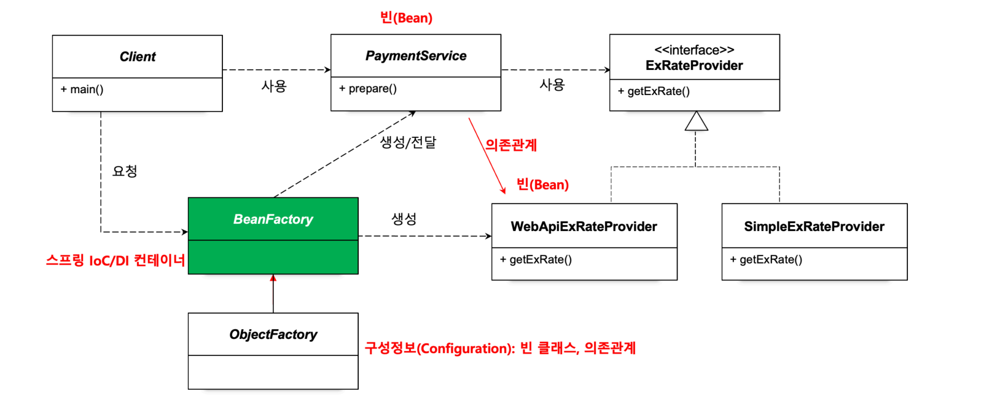
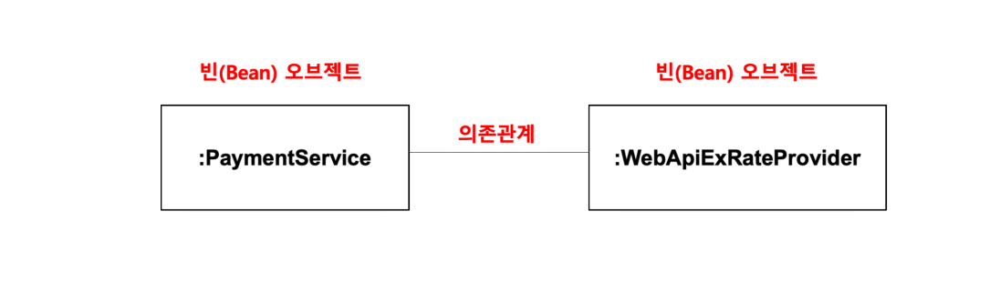

### 스프링 컨테이너와 의존관계 주입 (Dependency Injection)


`ObjectFactory`는 `BeanFactory`라고 부를 수 있으며, 이제부터는 스프링이 제공하는 빈 팩토리를 사용하도록 한다.

최종적으로는 이런 의존관계를 갖는다.

```java
public static void main(String[] args) throws IOException {  
    // 빈 팩토리로 마이그레이션
    BeanFactory beanFactory = new AnnotationConfigApplicationContext(ObjectFactory.class);  
    PaymentService paymentService = beanFactory.getBean(PaymentService.class);  
  
    Payment payment = paymentService.prepare(100L, "USD", BigDecimal.valueOf(50.7));  
    System.out.println(payment);  
}
```
`ObjectFactory` 대신 `BeanFactory` 를 사용하면서 프레임워크를 사용할 수 있다.

```java
@Configuration  
public class ObjectFactory {  
    @Bean  
    public PaymentService paymentService() {  
        return new PaymentService(exChangeRateProvider());  
    }  
  
    @Bean  
    public ExChangeRateProvider exChangeRateProvider() {  
        return new SimpleExRateProvider();  
    }  
}
```
기존 `ObjectFactory` 클래스에는 `@Configuration` 과 `@Bean` 이라는 이름을 붙여준다.

#### 결국 스프링을 한 줄로 정의하면, 
> **빈 팩토리를 사용하여** 자주 사용하는 기능들을 제공하여 **객체지향 원칙을 적용**할 수 있게해주는 **프레임워크**
> **Spring = DI-IoC Container**

### 구성정보를 가져오는 또다른 방법
`@Configuration`클래스를 주석처리하고 각 클래스에 `@Component`를 붙여준다.
```java
@Component  
public class PaymentService { }

@Component  
public class SimpleExRateProvider implements ExChangeRateProvider { }
```

설정정보에는 스캔하도록 요청한다.
```java
@Configuration  
@ComponentScan  
public class ObjectFactory { }
```

### 싱글톤 레지스트리

> 스프링은 스스로의 정체성을 싱글톤 레지스트리라고 표현한다

- 스프링 컨테이너가 갖는 또 하나의 특징
- 싱글턴 패턴 자체가 갖는 한계가 명확하기에 Spring Framework는 비슷한 기능을 제공한다
- 스프링은 대부분의 오브젝트를 자체적으로 하나만 만들어서 사용한다

