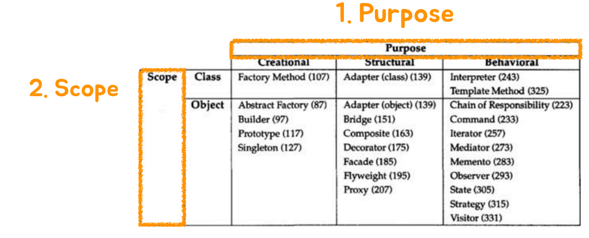
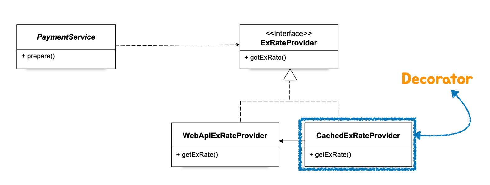
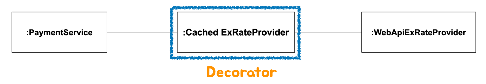

- 목적에 따라 디자인패턴을 구분할 수도 있고,
- Scope 로 구분할 수도 있다
	- Class 패턴 : 상속
		- 상속을 통한 디자인 패턴은 한계가 명확하기 때문에 별로 종류가 많지않다.
	- Object 패턴 : 합성
		- 오브젝트가 관계를 갖고 프로그램이 수행될때 이 관계를 바탕으로 실행되게 하자는 모토
		- DI는 Object 패턴과 연관이 있다.
- 오브젝트 합성을 이용하는 디자인 패턴을 적용할 때, **스프링의 의존관계 주입**을 사용

### 새로운 요구사항의 등장
만약 Web API를 통해 환율정보를 가져오는 것에 캐시를 도입하려면, Cache를 적용해본다.
→ 이때 `WebApiExRateProvider` 코드를 수정하는게 아니라 **데코레이터(Decorator) 디자인 패턴**을 적용해보자

> **데코레이터(Decorator) 디자인 패턴**
> 오브젝트에 부가적인 기능/책임을 동적으로 부여한다


```java
@Configuration  
public class ObjectFactory {  
    @Bean  
    public PaymentService paymentService() {  
        return new PaymentService(cachedExRatedProvider());  
    }  
  
    @Bean  
    public ExRateProvider cachedExRatedProvider() {  
        return new CachedExRateProvider(exChangeRateProvider());  
    }  
  
    @Bean  
    public ExRateProvider exChangeRateProvider() {  
        return new WebApiExRateProvider();  
    }  
}
```
→ 설계에 맞게 의존관계를 수정한다.
```java
public class CachedExRateProvider implements ExRateProvider {  
  
    private final ExRateProvider target;  
    private BigDecimal cachedExRate;  
  
    public CachedExRateProvider(ExRateProvider target) {  
        this.target = target;  
    }  
  
    @Override  
    public BigDecimal getExRate(String currency) throws IOException {  
        if(cachedExRate == null) {  
            cachedExRate = target.getExRate(currency);  
            System.out.println("Cache Updated");  
        }  
        return cachedExRate;  
    }  
}
```
→ 캐싱 기능을 추가한 `getExRate()` 함수를 작성한다. 시간 제한을 둔 부분은 이 코드에 포함되어있지 않다.

> `CachedExRateProvider` 클래스와, `ObjectFactory`클래스(설정정보)의 수정만 가지고, 변경된 요구사항을 만족하게되었다. (**기존의 코드는 수정되지 않았다.**)
> 이것이 데코레이터 패턴의 장점이며, 디자인 패턴을 공부해야하는 이유다.

