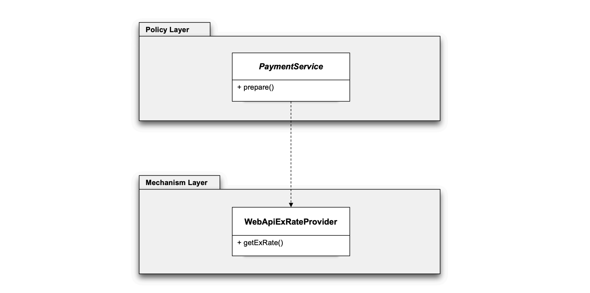
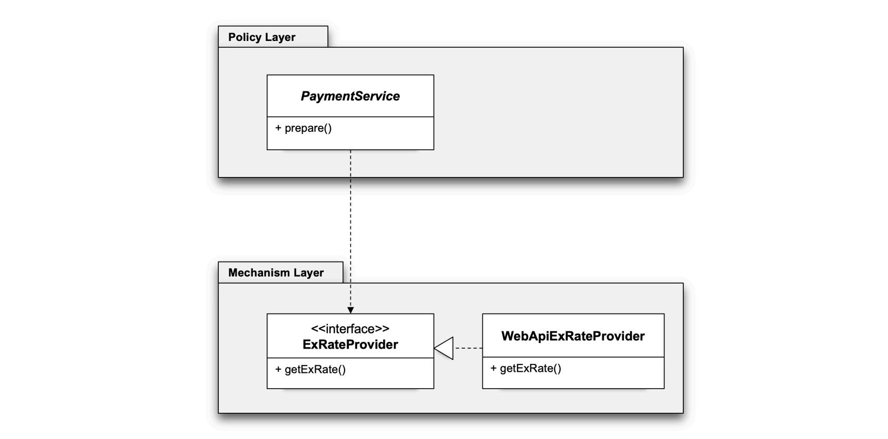
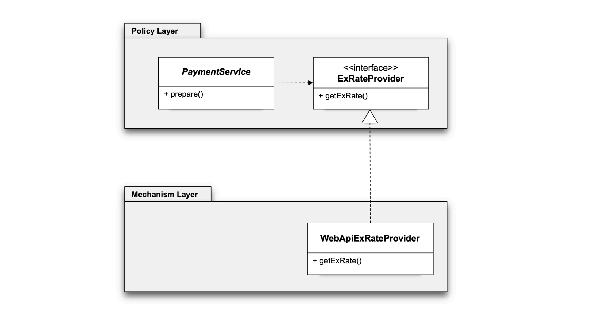

> 1. 상위 수준의 모듈은 하위 수준의 모듈에 의존해서는 안된다. 둘 모두 **추상화에 의존해야한다.**
> 2. 추상화는 구체적인 사항에 의존해서는 안된다. 구체적인 사항은 추상화에 의존해야한다.


이렇게 두개의 모듈로 코드를 구분할 수 있다. 
모듈을 구분할 때는 주로 패키지를 기준으로 구분하게된다.
```
└── hellospring
    ├── Client.java
    ├── ObjectFactory.java
    ├── Sorting.java
    ├── exrate
    │   ├── CachedExRateProvider.java
    │   ├── ExRateData.java
    │   ├── ExRateProvider.java
    │   ├── SimpleExRateProvider.java
    │   └── WebApiExRateProvider.java
    └── payment
        ├── Payment.java
        └── PaymentService.java
```

### 추상화에 의존해야 한다.
추상화 = 인터페이스를 도입한다.

→ 이렇게 코드를 분리하고, 의존관계 주입을 통해 서로 의존성을 구성해주는게 필요하다.
하지만 여진히, 상위수준의 모듈(Policy Layer)이 하위수준의 모듈(Mechanism Layer)를 의존하는것은 맞다.

**이를 해결하려면 인터페이스 소유권의 역전이 필요하다** → *Seperated Interface* 패턴
### Seperated Interface 패턴 - 의존성 역전 원칙을 따르는 코드
인터페이스는 인터페이스를 구현한 클래스들이 모여있는 패키지에 위치하는게 자연스럽다고 생각할 수 있다.
근데 많은 경우에 이를 구현하는 클래스 쪽에 위치하는것이 아니라, 이를 **사용하는 쪽에 위치시키는게 자연스럽다**고한다.

```
└── hellospring
    ├── Client.java
    ├── ObjectFactory.java
    ├── Sorting.java
    ├── exrate
    │   ├── CachedExRateProvider.java
    │   ├── ExRateData.java
    │   ├── SimpleExRateProvider.java
    │   └── WebApiExRateProvider.java
    └── payment
        ├── ExRateProvider.java
        ├── Payment.java
        └── PaymentService.java
```


→ 이렇게 하면 온전히 의존성 역전 원칙을 지켰다고 한다. 
혹시라도 상위 모듈(Policy Layer)에서 기능 변경이 필요하다고 하면, 각각의 모듈내에서 수정이 가능해진다.