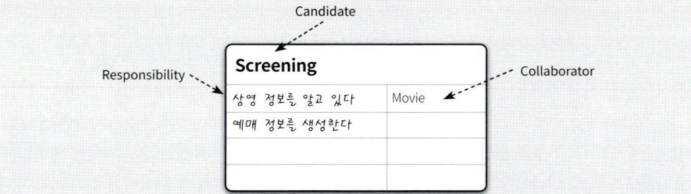
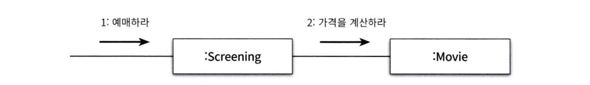
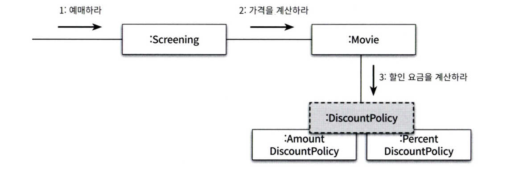

# Chapter 03. 역할 책임, 협력

객체지향 패러다임의 관점에서 핵심은 역할(role), 책임(responsibility), 협력(collaboration) 이다.
객체지향의 본질은 **협력하는 객체들의 공동체를 창조**하는 것이다. 
이 핵심은, 협력을 구성하기 위해 **적절한 객체를 찾고 적절한 책임을 할당하는 과정**에서 드러난다.

객체들은 요청의 흐름을 따라 자신에게 분배된 로직을 실행하면서 애플리케이션의 전체 기능을 완성한다.
- 객체들이 애플리케이션의 기능을 구현하기 위해 수행하는 상호작용을 **협력**이라고 한다.
- 협력에 참여하기 위해 수행하는 로직을 **책임**이라고 부른다.
- 협력안에서 책임들이 모여 객체가 수행하는 **역할**을 구성한다.
### 협력

협력은 객체지향의 세계에서 기능을 구현할 수 있는 유일한 방법이다.

- **메시지 전송**(message sending)은 객체 사이의 협력을 위해 사용할 수 있는 유일한 커뮤니케이션 수단이다.
- 메시지를 수신한 객체는 **메서드**를 실행해 요청에 응답한다. 여기서 요청에 대해 처리할 방법을 객체는 스스로 결정해아한다.
- 결과적으로 객체를 자율적으로 만드는 가장 기본적인 방법은 **내부 구현을 캡슐화** 하는 것이다. 이를 통해 변경에 대한 파급효과를 억제할 수 있다.

### 협력이 설계를 위한 Context을 결정한다

객체지향은 객체를 중심에 놓는 프로그래밍 패러다임이다. "어떤 객체도 섬이 아니다." 애플리케이션 안에 어떤 객체가 필요하다면 그 객체가 협력에 참여하여야한다.

- **객체의 행동**을 결정하는 것은 객체가 참여하고 있는 협력이다. 
- **객체의 상태**를 결정하는 것은 객체의 행동이다.

결과적으로 객체가 참여하는 협력이 객체를 구성하는 행동과 상태 모두를 결정한다. 따라서 협력은 객체를 설계하는 데 필요한 일종의 컨텍스트를 제공한다.

### 책임

책임이란 객체에 의해 정의되는 응집도 있는 행위의 집합으로 객체가 유지해야하는 정보와 수행할 수 있는 행동에 대해 **개략적으로 서술한 문장**이다. 
객체의 책임은 객체가 무엇을 알고 있는가(knowing)와 무엇을 할 수 있는가(doing)로 구성된다.

- 하는 것 (Doing)
	- 객체를 생성하거나 계산을 수행하는 등의 스스로 하는 것
	- 다른 객체의 행동을 시작시키는 것
	- 다른 객체의 활동을 제어하고 조절하는 것
- 아는 것(Knowing)
	- 사적인 정보에 관해 아는 것
	- 관련된 객체에 대해 아는 것
	- 자신이 유도하거나 계산할 수 있는 것에 대해 아는것

협력 안에서 객체에게 할당한 책임이 외부의 인터페이스와 내부의 속성을 결정한다.

> 객체지향 개발에서 가장 중요한 능력은 책임을 능숙하게 소프트웨어 객체에 할당하는 것

**CRC카드 작성을 통해 책임을 통해 객체를 잘 정의할 수 있다.**

- [Designing with CRC Card](https://medium.com/mindful-programmer/designing-with-crc-cards-9d53a6d92457)
- [How I use CRC (Class Responsibility Collaboration) Cards every day (Part 1)](https://medium.com/mindful-programmer/designing-with-crc-cards-9d53a6d92457)

### 책임 할당
자율적인 객체를 만드는 가장 기본적인 방법은 책임을 수행하는 데 필요한 정보를 가장 잘 알고 있는 전문가에게 그 책임을 할당하는 것이다. 
이를 책임할당을 위한 **INFORMATION EXPERT PATTERN(정보 전문가 패턴)** 으로 부른다.

출발 점은 협력이라는 컨텍스트를 정의하는 것이다. 
시스템이 **사용자에게 제공하는 기능을 시스템이 담당할 하나의 책임으로 바라보는 것**이다. 
객체지향 설계는 시스템이 **책임을 완료하는 데 필요한 더 작은 책임을 찾아내고 이를 객체들에게 할당하는 반복적인 과정**을 통해 모양을 갖춰간다.

1. 책임을 할당한다는 것은 **메시지의 이름을 결정**하는 것과 같다. 

2. 메시지를 선택했으면 메시지를 처리할 **적절한 객체를 선택**해야 한다.

3. 영화를 예매하기 위해서는 예매 가격을 계산해야 한다. 하지만 `Screening`객체는 필요한 정보를 충분히 알고 있지 않다. 따라서 외부의 객체에게 요청해야한다.

4. 이를 받는 객체를 선택하자.

> 객체지향 설계는 협력에 필요한 메시지를 찾고 메시지에 적절한 객체를 선택하는 반복적인 과정을 통해 이루어진다.
> 이렇게 결정된 메시지가 객체의 퍼블릭 인터페이스를 구현한다.

> **책임 주도 설계**
> 책임을 찾고 책임을 수행할 적절한 객체를 찾아 책임을 할당하는 방식으로 협력을 설계하는 방법을 책임 주도 설계(**Responsibility-Driven Design**, RDD)라고 부른다.

### 메시지가 객체를 결정한다

객체가 메시지를 선택하는 것이 아닌, 메시지가 객체를 선택하도록 설계하는 것이 중요하다.
이러한 설계의 장점은,

- 객체가 최소한의 인터페이스(minimal interface)를 가질 수 있게 된다.
- 객체는 충분히 추상적인 인터페이스(abstract interface)를 가지게 된다.

### 역할

객체가 어떤 특정한 협력 안에서 수행하는 책임의 집합을 역할이라고 부른다.
협력을 모델링 할때, 특정한 객체가 아니라 역할에게 책임을 할당한다고 생각하는 것이 좋다.

여기서 `DiscountPolicy`가 역할이다. 아래의 `AmountDiscountPolicy`와 `PercentDiscountPolicy`의 두 종류의 객체를 포괄하는 **추상화**이다.

요점은 동일한 책임을 수행하는 역할을 기반으로 두 개의 협력을 하나로 통합할 수 있다는 것이다.
이러한 설계는 다음의 장점을 갖는다.

- 불필요한 코드 중복을 제거할 수 있다.
- 협력이 더 유연해진다.

> **역할의 구현**
> 역할을 구현하는 가장 일반적인 방법은 **추상 클래스**와 **인터페이스**를 사용하는 것이다. 협력의 관점에서 추상 클래스와 인터페이스는 구체 클래스들의 따라야하는 책임의 집합을 서술한 것이다.

### 객체 vs. 역할

대부분의 경우 어떤 것이 역할이고 객체인지 또렷하게 드러나지 않는다. 
애매하다면, 단순하게 객체로 시작하고 반복적으로 책임과 협력을 정제해가면서 필요한 순간에 객체로 부터 역할을 분리해내는 것이 가장 좋은 방법이다.

객체는 **다양한 역할을 가질 수 있다**. 객체는 여러 역할을 가질 수 있지만, **특정한 협력 안에서는 일시적으로 오직 하나의 역할만이 보여진다는 점**에 주의해라.
