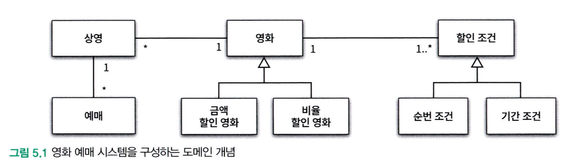
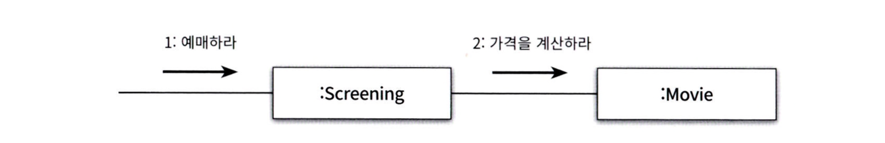
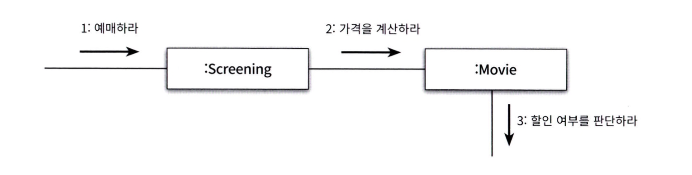
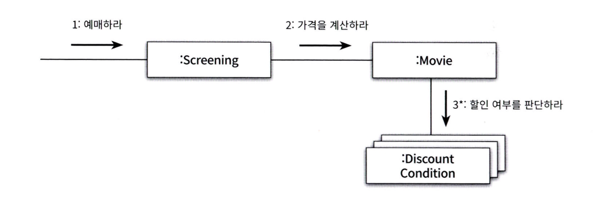
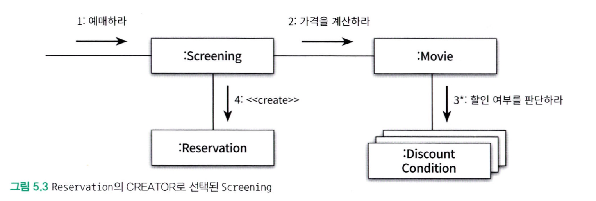

# Chapter 05. 책임
### 데이터보다 행동을 먼저 결정하라
객체에게 중요한 것은 데이터가 아니라 **외부에 제공하는 행동**이다.
객체는 협력에 참여하기 위해 존재하며 협력 안에서 수행하는 책임이 객체의 존재가치를 증명한다.

우리가 개발할 때 많은 경우 너무 이른 시기에 데이터에 초점을 맞추면, 객체의 캡슐화가 약화되기 때문에 낮은 응집도와 높은 결합도를 가진 객체들이 많아진다.
반면, 책임중심의 설계에서는 객체의 행동, 즉 책임을 먼저 결정한 후에 객체의 상태를 결정한다.
### 협력이라는 문맥 안에서 책임을 결정한다
객체의 책임을 어떻게 식별해야 하는가에 대한 힌트를 제공한다. 
**협력을 시작하는 주체는 메시지 전송자**이기 때문에 협력에 적합한 책임이란 메시지 수신자가 아니라 메시지 전송자에게 적합한 책임을 의미한다.

- 협력에 적합한 책임을 수확하기 위해서는 객체를 결정한 후에 메시지를 선택하는 것이 아닌,
- 메시지를 결정한 후에 객체를 선택해야한다.

> **메시지가 클라이언트의 의도를 표현한다.**
> 클라이언트는 단지 임의의 객체가 메시지를 수신할 것이라는 사실을 믿고 자신의 의도를 표현한 메시지를 전송할 뿐이다.
> 메시지를 수신하기로 결정된 객체는 메시지를 처리할 '책임'을 할당 받게 된다.

### 책임 할당을 위한 GRASP 패턴

#### 도메인 개념에서 출발하기
도메인 안에는 무수히 많은 개념들이 존재하며, 도메인 개념들을 책임 할당의 대상으로 사용하면 코드에 도메인의 모습을 투영하기가 좀 더 수월해진다.

> **올바른 도메인 모델이란 존재하지않는다.** 
> 도메인 모델은 도메인을 개념적으로 표현한 것이지만 그 안에 포함된 개념과 관계는 구현의 기반이 돼야한다. 
> 하지만 코드를 구현하면서 얻게되는 통찰이 도메인에 대한 개념을 바꾼다. 
> 이는 올바른 도메인 모델이란 존재하지 않는다는 사실을 잘 보여준다.
#### 정보 전문가에게 책임을 할당하라

책임 주도 설계를 위한 첫 단계는 애플리케이션이 제공해야 하는 기능을 애플리케이션의 책임으로 생각하는 것이다.
이 **책임을 애플리케이션에 대해 전송된 메시지로 간주**하고 이 **메시지를 책임질 첫 번째 객체를 선택하는 것으로 설계를 시작**한다.

GRASP 에서는 이걸 정보 전문가 패턴이라고 한다. 가장 잘 아는 객체에게 메시지를 도착하게 설계하는 것이다.

> 메시지를 전송할 객체는 무엇을 원하는가?

메시지를 결정했으므로 메시지에 적합한 객체를 선택해야 한다.

> 메시지를 수신할 적합한 객체는 누구인가?

만약 스스로 처리할 수 없는 것이라면 다른 객체에 메시지를 보내 필요한 정보를 받아와야 할 것이다. 이런 식으로 재귀형태로 파고들어가면 된다.

#### 높은 응집도와 낮은 결합도
설계는 트레이드오프 활동이다. 
동일한 기능을 구현할 수 있는 무수히 많은 설계가 존재한다.
서로 다른 설계 중 높은 응집도와 낮은 결합도를 얻을 수 있는 설계가 있다면 그 설계를 선택해야한다.

#### 창조자에게 객체 생성 책임을 할당하라
GRASP의 창조자 패턴은 객체를 생성할 책임을 어떤 객체에 게 할당할 지에 대한 지침을 제공한다.

