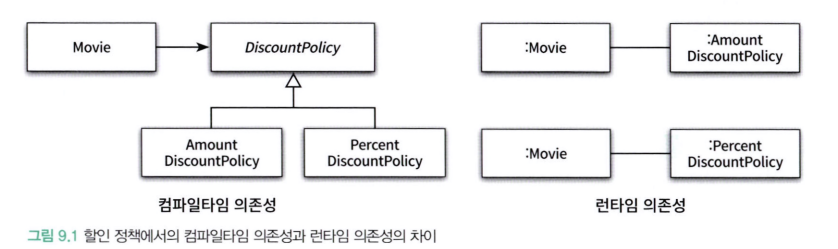

# Chapter 09. 유연한 설계

## 1. 개방 폐쇄 원칙(OCP)

로버트 마틴은 확장가능하고 변화에 유연하게 대응할 수 있는 설계를 만들 수 있는 원칙 중 하나로, **개방-폐쇄 원칙** (Open-Closed Principle, OCP)를 고안했다. 

> 소프트웨어 개체(클래스, 모듈, 함수 등등)은 확장에 대해 열려있어야하고, 수정에 대해 닫혀있어야한다.

여기서 키워드는 **확장**과 **수정**이다.

- **확장에 대해 열려있다**: 애플리케이션의 요구사항이 변경될 때 이 변경에 맞게 새로운 '동작'을 추가해서 애플리케이션의 기능을 확장할 수 있다.
- **수정에 대해 닫혀있다**: 기존의 '코드'를 수정하지 않고도 애플리케이션의 동작을 추가하거나 변경할 수 있다.

### 컴파일 타임 의존성을 고정시키고 런타임 의존성을 변경하라

개방 폐쇄 원칙은 런타임 의존성과 컴파일타임 의존성에 대해 다루는 것이다.



두 경우 모두 기존 클래스는 전혀 수정하지 않은 채 애플리케이션의 동작을 확장했다.

의존성 관점에서 개방-폐쇄 원칙을 따르는 설계란 컴파일타임 의존성은 유지하면서 런타임 의존성의 가능성을 확장하고 수정할 수 있는 구조라고 할 수 있다.

### 추상화가 핵심이다

OCP의 핵심은 추상화에 의존하는 것이다. 추상화 과정을 거치면 문맥이 바뀌더라도 변하지 않는 부분만 남게되고 문맥에 따라 변하는 부분은 생략된다. 생략된 부분을 문맥에 적합한 내용으로 채워넣음으로써 각 문맥에 적합하게 기능을 구체화하고 확장할 수 있다.


## 2. 생성 사용 분리

```java
public class Movie {
    // ...

    private DiscountPolicy discountPolicy;

    public Movie(String title, Duration runningTime, Money fee) {
        // ...
        this.discountPolicy = new AmountDiscountPolicy(...);
    }

    public Money calculateMovieFee(Screening screening) {
        return fee.minus(discountPolicy.calculateDiscountAmount(screening));
    }
}
```

위 코드는 사용하고자 하는 클래스의 인스턴스를 생성하는 부분이 클라이언트에 있기 때문에 만약 대상 클래스가 변경되면 클라이언트 코드가 같이 수정되는 오류가 있다. (이는 OCP를 위반했다고 볼 수 있다)

물론 객체 생성을 피할 수는 없다. 어딘가에서는 반드시 객체를 생성해야한다.

동일한 클래스 안에서 객체 생성과 사용이라는 두 가지 이질적인 목적을 가진 코드가 공존하는 것이 문제이다.

### FACTORY 추가하기 

객체 생성과 관련된 지식을 다른 클래스에 캡슐화해두면, 코드 변경이 최소화 될 수 있다. 적어도 클라이언트는 몰라도된다.

**생성과 사용을 분리** 하기 위해 FACTORY 클래스를 추가할 수 있다.

```java
public class Factory {
    public Movie createAvatarMovie() {
        return new Movie("아바타",
                         Duration.ofMinutes(120),
                         Money.wons(10000),
                         new AmountDiscountPolicy(...));
    }
}
```

### 순수한 가공물에 책임 할당하기

크레이그 라만은 시스템을 객체로 분해하는 데는 크게 두 가지 방식이 존재한다고 설명한다.

- 표현적 분해: 도메인에 존재하는 사물 또는 개념을 표현하는 객체들을 이용해 시스템을 분해하는 것.
  - 도메인과 소프트웨어 사이의 표현적 차이를 최소화한다.

도메인 모델은 설계를 위한 중요한 출발점이지만 단지 출발점이다. 

도메인과 무관한 인공적인 객체를 **PURE FABRICATION**(순수한 가공물)이라고 불리는데, 필요하면 당연히 설계에 없었더라도 포함해야한다.

- 특정 행동을 책임질 마땅한 도메인개념이 존재하지 않는다면 PURE FABRICATION을 추가하고 이 객체에 책임을 할당
- 도메인 개념이 만족스럽지 못하다면 망설이지 말고 객체를 참조해야함

## 3. 의존성 주입

외부의 독립적인 객체가 인스턴스를 생성한 후 이를 전달해서 의존성을 해결하는 방법을 의존성 주입이라고 부른다.

의존성 주입의 방법에는 다음과 같은 것들이 있다.
- 생성자 주입
- setter 주입
- 메서드 주입

### 숨겨진 의존성은 나쁘다

의존성 주입 외에도 의존성을 해결할 수 있는 다양한 방법이 존재한다. 대표적인 방법은 SERVICE LOCATOR 패턴이다. SERVICE LOCATOR는 의존성을 해결할 객체들을 보관하는 일종의 저장소이다.

하지만 이런 경우 의존성이 명시적으로 드러나지 않아서 비선호된다. 꼭 필요할때만 찾아서 사용하는 것이 좋다.

> 스프링은 **Service Locator 패턴 대신 의존성 주입을 강력하게 추천**합니다. 그 이유는 다음과 같습니다.
> - **낮은 결합도** (Loose Coupling): 의존성 주입을 통해 컴포넌트는 자신이 필요로 하는 의존성을 직접 찾는 것이 아니라 외부로부터 제공받기 때문에, 다른 컴포넌트와의 결합도가 낮아집니다. 이는 코드 변경의 파급 효과를 줄이고 유지보수성을 향상시킵니다.
> - **높은 테스트 용이성** (Testability): 의존성이 외부에서 주입되므로, 테스트 시에 실제 의존성 대신 Mock 객체를 쉽게 주입하여 격리된 환경에서 컴포넌트를 테스트할 수 있습니다.
> - **코드의 명확성** (Clarity): 클래스의 생성자나 Setter 메서드를 통해 어떤 의존성이 필요한지 명확하게 드러나므로, 코드의 가독성이 높아집니다.
> - **유연성 및 재사용성** (Flexibility and Reusability): 컴포넌트가 특정 구현체에 의존하는 것이 아니라 인터페이스나 추상 클래스에 의존하게 되므로, 다양한 구현체로 쉽게 교체하거나 재사용할 수 있습니다.

## 4. 의존성 역전 원칙

객체 사이의 협력이 존재할 때 그 협력의 본질을 담고 있는 것은 상위 수준의 정책이다.


DiscountPolicy의 변경으로 Movie가 영향을 받아서는 안된다. 

즉, 하위수준의 변경으로 인해 상위 수준이 영향을 받으면 안된다. 이를 해결하는 해결사는 추상화이다. 

추상화에 의존하도록 수정하면 하위 수준 클래스의 변경으로 인해 상위수준의 클래스가 영향을 받는 것을 방지할 수 이싿. 

### SEPERATED INTERFACE 패턴

SEPARATED INTERFACE 패턴은 클라이언트가 직접 구현 클래스에 의존하는 대신, 역할(Role)을 정의하는 인터페이스를 통해 상호작용하도록 설계하는 패턴이다. 이를 통해 시스템의 결합도를 낮추고 유연성과 확장성을 높일 수 있다.

핵심 아이디어:

- **역할 분리**: 클라이언트는 특정 기능을 수행하는 "역할"에만 관심을 갖고, 그 역할을 실제로 어떻게 구현하는지는 알 필요가 없습니다. 이 "역할"은 Java 인터페이스로 정의됩니다.
- **구현체 분리**: 실제 기능 구현은 인터페이스를 구현하는 구체적인 클래스에서 담당합니다.
- **의존성 분리**: 클라이언트는 구현 클래스가 아닌 인터페이스에 의존하게 되므로, 구현체가 변경되더라도 클라이언트 코드에 영향을 주지 않습니다.

### 유연성에 대한 조언

- 유연성은 항상 복잡성을 수반한다. 유연하지 않은 설계는 단순하고 명확하다. 
- 협력을 재사용할 필요가 없다면 설계를 유연하게 만들 당위성도 함께 사라진다. 
- 객체의 역할과 책임이 자리를 잡기 전에 너무 성급하게 객체 생성에 집중하지 마라.
