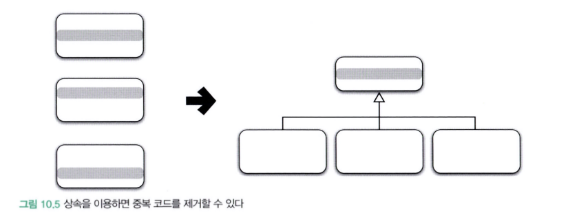

# Chapter 10. 상속과 코드 재사용

## 1. 상속과 중복 코드

중복 코드는 사람들의 마음속에 의심과 불신의 씨앗을 뿌린다.

다음과 같이 사람을 힘들게 한다.

- 우선 어떤 코드가 중복인지 찾아야한다. 
- 모든 중복 코드를 개별적으로 테스트해서 같은 결과를 내는지 봐야한다.

### DRY원칙

DRY는 반복하지 마라 뜻의 "Don't Repeat Yourself"의 첫 글자를 모아 만든 용어로 간단히 말해 동일한 지식을 중복하지 말라는 뜻이다.

### 상속을 이용해서 중복 코드 제거하기

상속을 사용하면 코드를 중복시키지 않고도 부모 클래스의 코드 대부분을 재사용 할 수 있다.

일부분만 `@Override` 어노테이션을 이용해 재정의 하면 된다. 

## 2. 취약한 기반 클래스 문제

상속은 자식클래스와 부모 클래스의 결합도를 높인다.

자식 클래스는 부모 클래스의 불필요한 세부사항에 엮이게 된다. 부모 클래스의 작은 변경에도 자식 클래스는 컴파일 오류와 실행 에러라는 고통에 시달려야 할 수도 있다.

### 상속을 위한 경고

1. 자식 클래스의 메서드 안에서 `super` 참조를 이용해 부모 클래스의 메서드를 직접 호출할 경우 두 클래스는 더욱 강하게 결합된다. `super` 호출을 제거할 수 있는 방법을 찾아 결합도를 제거해라
2. 상속받은 부모 클래스의 메서드가 자식 클래스의 내부 구조에 대한 규칙을 깨트릴 수 있다.
3. 자식 클래스가 부모 클래스의 메서드를 오버라이딩할 경우 부모 클래스가 자신의 메서드를 사용하는 방법에 자식 클래스가 결합될 수 있다.

## 3. 상속 코드를 전체적으로 개선해서 결합도를 낮추기

결국 위 그림을 따르는 코드가 되었을 때, 상속을 사용하는 최선의 코드가 될 수 있다.

### 추상화에 의존하자

- 두 메서드가 유사하게 보인다면 차이점을 메서드로 추출하라. 메서드 추출을 통해 두 메서드를 동일한 형태로 보이도록 만들 수 있다.
- 부모 클래스의 코드를 하위로 내리지 말고 자식 클래스의 코드를 상위로 올려라.

### 차이를 메서드로 추출하자

중복 코드 안에서 차이점을 별도의 메서드로 추출하는 것. 

- "변하는 것으로부터 변하지 않는 것을 분리하라."
- "변하는 부분을 찾고 이를 캡슐화하라."

### 중복 코드를 부모 클래스로 올려라

모든 클래스들이 추상화에 의존하도록 만드는 것이기 때문에 이 클래스는 추상 클래스로 구현하는 것이 적합하다.

