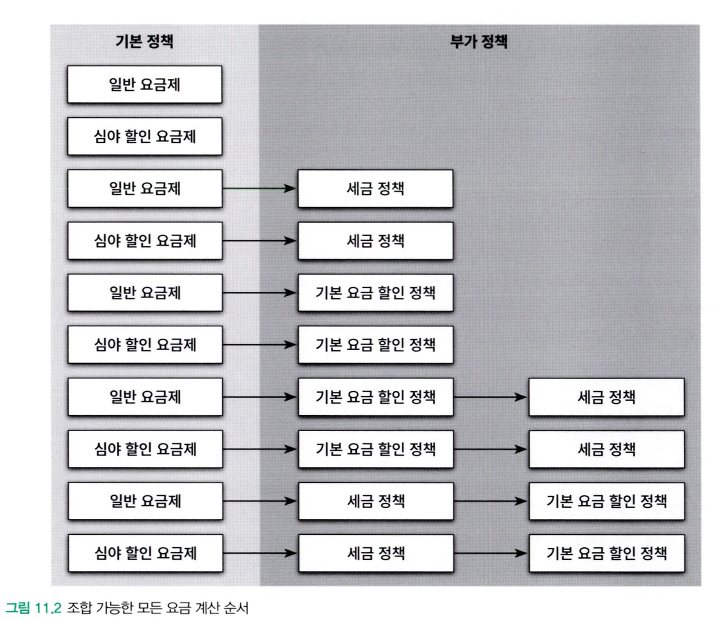
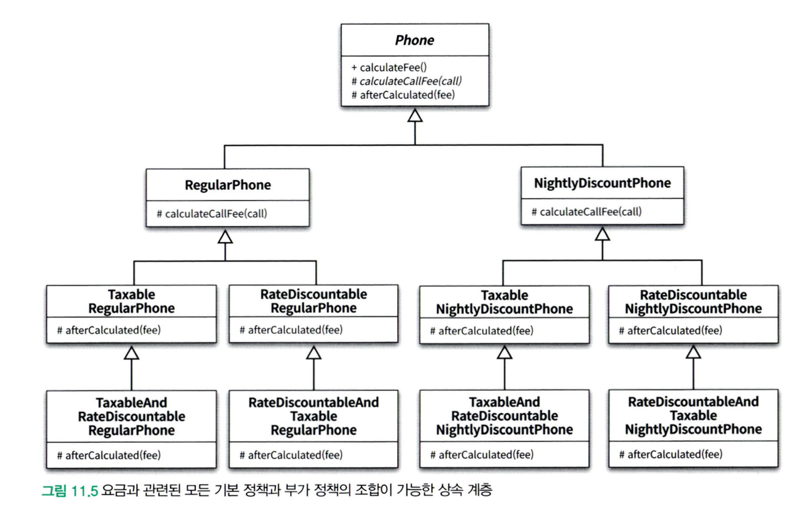
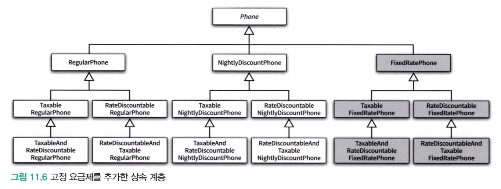
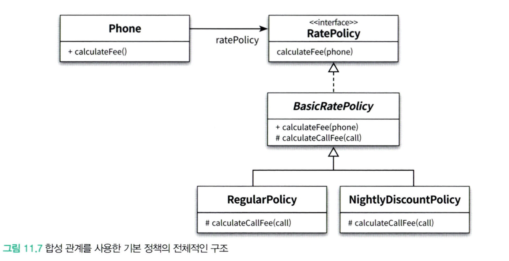
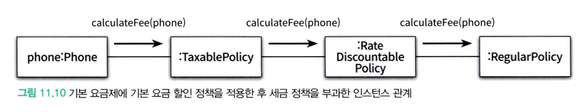

# Chapter 11. 합성과 유연한 설계

- 상속과 합성은 객체지향 프로그래밍에서 가장 널리 사용되는 코드 재사용 기법이다. 
	-  합성은 전체를 표현하는 객체가 부분을 표현하는 객체를 포함해서 부분 객체의 코드를 재사용한다.
	- 상속관계는 **is-a** 라고 부르고, 합성관계는 **has-a** 라고 부른다.
- 합성은 구현에 의존하지 않는다는 점에서 상속과 다르다. 객체의 구현이 아닌 퍼블릭 인터페이스에 의존한다.
	- 따라서 합성을 이용하면 구현이 변경되더라도 영향을 최소화 할 수 있기 때문에 변경에 안정적인 코드를 얻을 수 있다.
- 상속과 합성은 재사용의 대상이 다르다.
	- 상속은 부모 클래스 안에 구현된 코드 자체를 재사용 하지만 합성은 포함되는 객체의 퍼블릭 인터페이스를 재사용한다.

## 1. 상속의 문제점

- **불필요한 인터페이스 상속 문제**
	- **문제:** 자식 클래스가 부모 클래스의 구현 세부 사항까지 상속받게 되어, 자식 클래스 인스턴스의 상태가 불필요하게 변경될 수 있는 문제입니다.
	- **예시:** JDK에 포함된 `java.util.Properties`와 `java.util.Stack` 클래스를 통해 이러한 문제를 살펴볼 수 있습니다.
- **메서드 오버라이딩의 오작용 문제**
	- **문제:** 자식 클래스가 부모 클래스의 메서드를 오버라이딩할 때, 자식 클래스의 구현이 부모 클래스의 메서드 호출 방식에 의존하게 되어 예상치 못한 동작이 발생할 수 있습니다.
	- **예시:** `java.util.HashSet`을 상속받은 `InstrumentedHashSet` 클래스를 통해 이 문제를 확인할 수 있습니다.
- **부모 클래스와 자식 클래스의 동시 수정 문제**
	- 부모 클래스와 자식 클래스 간의 강한 결합(개념적인 결합) 때문에, 부모 클래스를 변경할 때 자식 클래스 또한 함께 변경해야 하는 유지보수상의 어려움이 발생합니다.

## 2. 상속으로 인한 조합의 폭발적인 증가

상속으로 인해 결합도가 높아지면 코드를 수정하는데 필요한 작업의 양이 과도하게 늘어나는 경향이 있다.

- 하나의 기능을 추가하거나 수정하기 위해 불필요하게 많은 수의 클래스를 추가하거나 수정해야한다.
- 단일 상속만 지원하는 언어에서는 상속으로 인해 오히려 중복 코드의 양이 늘어날 수 있다.

예시로 다양한 요금 계산 순서를 갖는 핸드폰 요금제가 있다.


이러한 구현을 위해 상속이라면 어떻게 해야할까?
-> 요금제라는 추상 클래스를 정의하고 이를 다양한 조합으로 상속하는 클래스들을 작성해야한다.

그럼,  아래와 같이 엄청나게 복잡한 상속 관계도가 도출된다.

이렇게 수정되는 이유는 부모 클래스의 로직을 상속 받아서 재사용하고,
여기에 경우의 수에 따른 고유 로직을 얹기 때문에 다양한 경우의 수가 존재하면 그 수만큼 구현 클래스가 존재해야한다.

여기에 고정 요금제를 추가하면? 

순서가 다른 요금 부여방식이 5개 생기기 때문에, 구현 클래스도 5개가 생긴다. 

> 하나의 기능을 추가하거나 수정하기 위해 불필요하게 많은 수의 클래스를 추가하거나 수정해야한다.

이렇게 상속의 남용으로 하나의 기능을 추가하기 위해 필요 이상으로 많은 수의 클래스를 추가해야 하는 경우는 **클래스 폭발**(class explosion) 또는 **조합의 폭발**(combinational explosion)이라고 부른다. 
## 3. 상속을 사용하여 이 문제를 해결하기

상속과 달리 합성 관계는 런타임에 동적으로 변경할 수 있다.  합성을 사용하면 구현 시점에 정책들의 관계를 고정시킬 필요가 없으며 실행 시점에 정책들의 관계를 유연하게 변경할 수 있게 된다.
### 전략 패턴 (Strategy Pattern)

다양한 요금 계산 알고리즘(정책)을 독립적인 클래스로 분리하고, 필요에 따라 교체하여 사용할 수 있도록 한다.

- `Phone` 객체는 **어떤 구체적인 `RatePolicy` 구현체(전략)를 사용할지** 런타임에 결정하거나 변경할 수 있다
- 이를 통해 `Phone` 클래스의 코드 변경 없이 요금 계산 로직을 쉽게 교체하거나 추가할 수 있습니다. 이것이 합성을 사용했을 때의 유연성.

### 데코레이터 패턴(Decorator Pattern)의 적용

데코레이터 패턴은 **객체의 기존 코드를 수정하지 않으면서** 런타임에 **동적으로 새로운 기능이나 책임을 추가**할 수 있게 해주는 구조 디자인 패턴이다. 
객체를 새로운 기능을 가진 다른 객체(데코레이터)로 **감싸는(wrapping)** 방식을 사용.
#### 유용한 case들
* 객체의 핵심 기능은 유지하면서 부가적인 기능을 선택적으로, 혹은 동적으로 추가하고 싶을 때
* 상속을 통해 기능을 확장하면 서브클래스가 너무 많아질 수 있을 때
* 객체의 원래 인터페이스를 유지하면서 기능을 확장해야 할 때 


기본 요금 계산 정책에 부가적인 책임(세금, 할인 등)을 동적으로 추가한다. 
객체를 포장(wrapping)하는 방식으로 기능을 확장합니다. (데코레이터 패턴)

-  기본 요금 계산(`RegularPolicy`) 객체를 다른 정책 객체(`RateDiscountablePolicy`, `TaxablePolicy`)들이 순차적으로 감싸는 형태
- `Phone`이 `TaxablePolicy`의 `calculateFee`를 호출하면, `TaxablePolicy`는 자신이 감싸고 있는 `RateDiscountablePolicy`의 `calculateFee`를 호출
- 이런 식으로 호출이 연쇄적으로 일어나 가장 안쪽의 `RegularPolicy`까지 도달하고, 그 결과가 다시 바깥쪽으로 전달되면서 각 데코레이터(부가 정책)가 자신의 로직(세금 추가, 할인 적용 등)을 적용된다.

```java
public abstract class AdditionalRatePolicy implements RatePolicy {
    private RatePolicy next;

    public AdditionalRatePolicy(RatePolicy next) {
        this.next = next;
    }

    @Override
    public Money calculateFee(Phone phone) {
        Money fee = next.calculateFee(phone);
        return afterCalculated(fee);
    }

    abstract protected Money afterCalculated(Money fee);
}
```
*데코레이터로 적용하는 예시*

이 역시 객체 간의 **합성**을 이용한 유연한 설계 방식이다.
- 기존 코드를 수정하지 않고 객체에 새로운 책임을 동적으로 추가할 수 있게 된다. 
- 데코레이터들을 어떤 순서로 조합하느냐에 따라 다양한 기능 조합을 런타임에 구성할 수 있다.