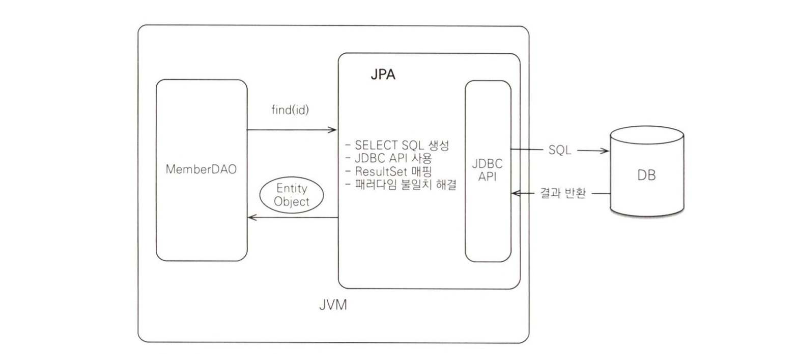

### 1.1 SQL을 직접 다룰 때 문제점
- 반복, 반복 그리고 또 반복
	- 데이터베이스는 객체 구조와는 다른 데이터 중심 구조를 가지므로 객체를 직접 저장하거나 조회할 수는 없다. 개발자가 중간에서 SQL과 JDBC API를 사용하여 변환 작업을 직접해주어야한다.
	- 문제는 객체를 데이터베이스에 CRUD하려면 너무 많은 SQL과 JDBC API를 코드로 작성해야한다는 점이다.
	- 테이블이 100개라면 SQL 은 수백개가 된다.
- SQL에 의존적인 개발
	- 비즈니스 요구사항을 모델링한 객체를 엔티티라고 한다
	- SQL에 모든 것을 의존하는 상황에서는 개발자들이 엔티티를 신뢰하고 사용할 수 없다.
	- 대신 DAO를 열어서 어떤 SQL이 실행되고 어떤 객체들이 함께 조회되는지 일일이 확인해야한다.

JPA를 사용하면 CRUD가 간편해진다~
```java
// 1. Create
jpa.persist(member);

// 2. Read
String memberId = "helloId";
Member member = jpa.find(Member.class, memberId);

// 3. 수정 기능
Member member = jpa.find(Member.class, memberId);
member.setName("이름변경");

// 4. 연관된 객체 조회
Member member = jpa.find(Member.class, memberId);
Team team = member.getTeam();
```

### 1.2 (객체지향프로그래밍) 패러다임의 불일치
- 객체지향 프로그래밍은 추상화, 캡슐화, 정보은닉, 상속, 다형성 등 시스템의 복잡성을 제어할 수 있는 다양한 장치를 제공한다.
- 비즈니스 요구사항을 도메인 모델도 객체로 모델링하면 객체지향 언어가 가진 장점들을 활용할 수 있다.
- 객체는 상속이라는 기능을 가지고 있지만 테이블은 상속이라는 기능이 없다.
	- 객체의 상속 
	- 그나마 슈퍼타입 서브타입 관계(모델링)을 사용하면 가장 유사한 상속기능을 구현할 수 있다.
	- DTYPE에 따라 다르게 설계하는 예시이다.
	- JPA는 상속과 관련된 패러다임의 불일치 문제를 해결해준다. 개발자는 자바 컬렉션에 객체를 저장하듯이 JPA에게 객체를 저장하면된다.
- 외래 키를 사용하는 관계형 데이터베이스의 스키마의 경우 객체지향 모델링이 정말 어려워진다.
	- 
	- `MEMBER.TEAM_ID`(외래 키 컬럼)을 사용하여 TEAM 테이블을 조회하도록 지원한다. 이는 `member.getTeam()`과 같은 코드이다.
#### 객체지향 모델링
객체는 참조를 통해서 관계를 맺는다. 따라서 참조를 사용하도록 객체를 모델링해야된다.
```java
class Member {
    String id;         // MEMBER_ID 컬럼 사용
    Team team;         // 참조로 연관관계를 맺는다.
    String username;   // USERNAME 컬럼 사용

    Team getTeam() {
        return team;
    }
}

class Team {
    Long id;           // TEAM_ID PK 사용
    String name;       // NAME 컬럼 사용
}
```
이런 설계는 아래의 코드를 통해 관계를 설정하고 SQL을 통해 Database에 저장이 가능토록한다.
```java
public Member find(String memberId) {
    // SQL 실행
    ...
    Member member = new Member();
    ...

    // 데이터베이스에서 조회한 회원 관련 정보를 모두 입력
    Team team = new Team();
    ...
    // 데이터베이스에서 조회한 팀 관련 정보를 모두 입력

    // 회원과 팀 관계 설정
    member.setTeam(team);
    return member;
}
```
이런 중간단계의 코드들은 모두 객체지향 패러다임의 문제를 해소하기 위한 **비용**이다. JPA는 이 비용을 감소시켜준다.
```java
member.setTema(team);
jpa.persist(member);
```
#### 객체 그래프 탐색
다음과 같은 객체 그래프는 서비스에 흔히 존재한다.

객체는 마음껏 이 그래프를 탐색할 수 있어야한다. 그러나 SQL을 실행하여 객체를 조회하면 SQL에 명시되지않은 객체는 조회되지 않았으므로, null pointer exception이 발생한다.

> SQL을 직접 다루면, 처음 실행하는 SQL에 따라 객체 그래프를 어디까지 탐색할 수 있는지 정해진다.

**JPA를 사용하면 객체그래프를 마음껏 탐색할 수 있다.**
```java
member.getOrder().getOrderItem()... // 자유로운 객체 그래프 탐색
```
JPA는 연관된 객체를 사용하는 시점에 적절한 **SELECT SQL**을 실행한다. 이 기능은 실제 객체를 사용하는 시점까지 데이터베이스 조회를 미룬다고하여 **지연로딩**이라고 한다.
### 1.3 JPA란 무엇인가?
JPA(Java Persistence API)는 자바 진영의 ORM 기술 표준이다. 다음과 같이 Application과 JDBC 사이에서 동작한다.

ORM(Object-Relational Mapping)은 이름 그대로 객체와 관계형 데이터베이스 테이블을 매핑한다는 뜻이다. 
ORM 프레임워크는 객체와 테이블을 매핑해서 패러다임 불일치 문제를 개발자 대신 해결해준다. ORM 프레임워크를 사용하면 자바 컬렉션에 저장하듯이 DB에 저장이 가능해진다.
```java
jpa.persist(member);
```

```java
Member member = jpa.find(memberId);
```

