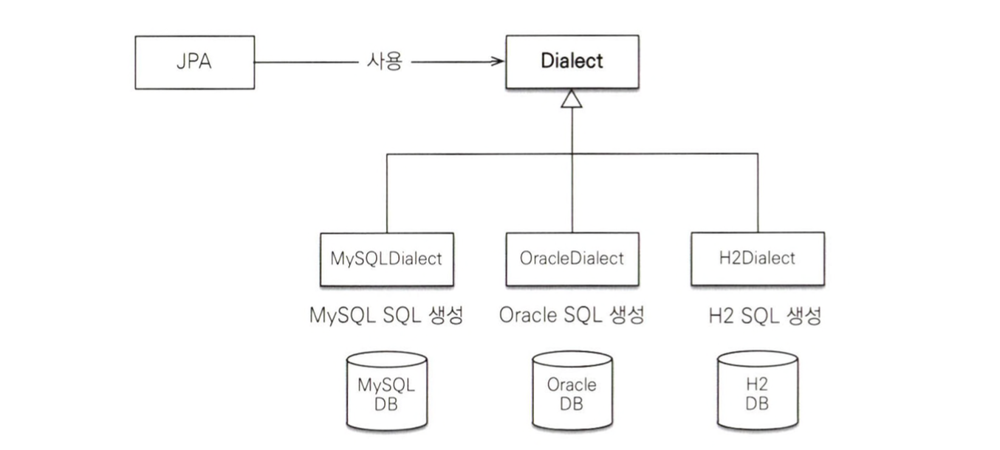
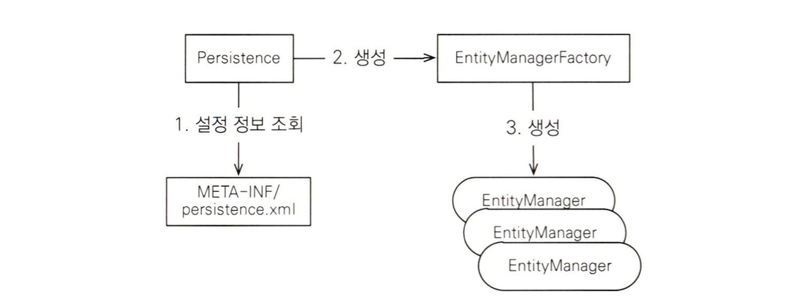

### 매핑 어노테이션
`@Entity`
- 이 클래스를 테이블과 매핑한다고 JPA에게 알려준다.
- 이 어노테이션이 달린 클래스를 엔티티 클래스라고 한다.
`@Table`
- 엔티티 클래스에 매핑할 정보를 알려준다.
- 이 어노테이션을 생략하면 엔티티 이름 (클래스 이름)을 테이블 이름으로 매핑한다.
`@Id`
- 엔티티 클래스의 필드를 테이블의 기본 키에 매핑한다
`@Column`
- 필드를 칼럼에 매핑한다. 
매핑정보가 없는 필드
- 매핑 어노테이션을 생략하면 필드명을 사용해서 컬럼명으로 매핑한다.
- 이 책에서는 데이터베이스가 대소문자를 구분하지 않는다고 가정했지만, 만약 대소문자를 구분한다면 명시적으로 표기해야한다.
```java
@Entity  
@Table(name="MEMBER")  
public class Member {  
    @Id  
    @Column(name="ID")  
    private String id;  
    @Column(name = "NAME")  
    private String username;  
    // 매핑정보가 없는 필드  
    private Integer age;
	// Getter & Setter...
}
```
### 데이터베이스 방언
JPA는 특정 데이터베이스에 종속적이지 않은 기능이다. 따라서 다른 데이터베이스로 손쉽게 교체가 가능하다.
그런데 각 데이터베이스가 제공하는 SQL 문법과 함수가 조금씩 다른 문제점이 존재하여 JPA에서는 방언(**Dialect**)을 지원한다

`Application.properties`에서 설정해주어야한다.
```gradle
# Hibernate 설정  
spring.jpa.database-platform=org.hibernate.dialect.H2Dialect  
spring.jpa.show-sql=true                      # SQL 쿼리 로그 출력  
spring.jpa.hibernate.ddl-auto=create-drop     # 애플리케이션 시작 시 스키마 생성 및 종료 시 삭제
```
### 애플리케이션 개발
```java
public static void main(String[] args) {  
    // [엔티티 매니터 팩토리] - 생성  
    EntityManagerFactory emf = 
		    Persistence.createEntityManagerFactory("jpabook");  
    // [엔티티 매니저] - 생성  
    EntityManager em = emf.createEntityManager();  
    // [트랜잭션] - 획득  
    EntityTransaction tx = em.getTransaction();  
  
    try {  
        tx.begin(); // [트랜잭션] - 시작  
        logic(em); // [비즈니스로직]  
        tx.commit(); // [트랜잭션] - 커밋  
    } catch (Exception e){  
        tx.rollback(); // [트랜잭션] - 예외발생 시 롤백  
    } finally {  
        em.close(); // [엔티티 매니저] - 종료  
    }  
    emf.close(); // [엔티티 매니터 팩토리] - 종료  
}
```
애플리케이션은 주로 다음과 같이 구성된다.
- 엔티티 매니저 설정
- 트랜잭션 관리
- 비즈니스 로직
#### 엔티티 매니저 팩토리 생성

**엔티티 매니저 팩토리는 애플리케이션 전체에서 딱 한번만 생성하고 공유해서 사용해야한다.**
- JPA 설정을 위한 설정정보를 읽어오고, 데이터베이스 커넥션 풀까지 만드므로 매우 비용이 크다.
#### 엔티티 매니저 생성
엔티티 매니저를 사용해서 엔티티를 데이터베이스에 직접 CRUD 할 수 있다. 
참고로 엔티티 매니저는 데이터베이스 커넥션과 밀접한 연관이 있으므로 **스레드간에 공유하거나 재사용하면 안된다.**
#### 비즈니스 로직
**등록**
```java
String id = "id1";  
Member member = new Member();  
member.setId(id);  
member.setUsername("지한");  
member.setAge(2);  
  
// CREATE  
em.persist(member);
```

**수정**
```java
// UPDATE  
member.setAge(20);
// Hibernate: /* update for chapter2.Member */update MEMBER set age=?,NAME=? where ID=?
```
JPA는 어떤 엔티티가 변경되었는지 추적하는 기능을 갖추고 있다. 따라서 엔티티의 값만 변경하면 UPDATE 문을 생성해서 데이터베이스에 값을반영한다.

**삭제**
```java
em.remove(member);
```

**한건 조회**
```java
Member findMember = em.find(Member.class, id);  
System.out.println(findMember);
```

**여러 건 조회 (JPQL)**
```java
List<Member> members = em.createQuery("select m from Member m", Member.class).getResultList();  
System.out.println(members.size());
```
JPA는 SQL을 추상화한 JPQL이라는 객체지향 쿼리 언어를 제공한다. SQL과 문법이 거의 유사하여 `SELECT`, `FROM`, `WHERE`, `GROUP BY`, `HAVING`, `JOIN` 등을 사용할 수 있다.
