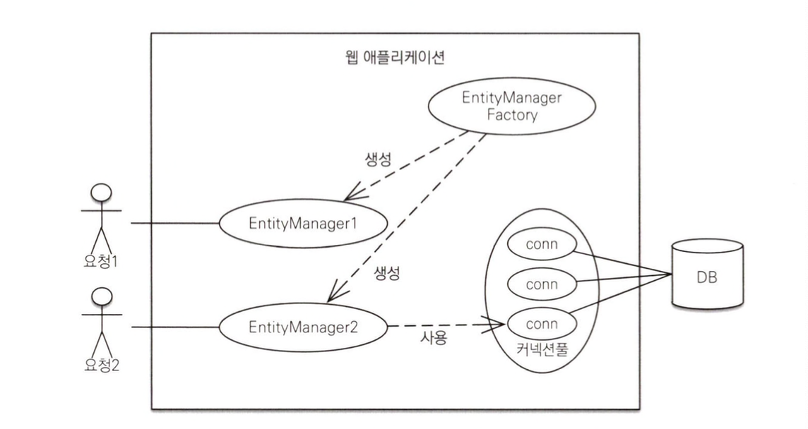
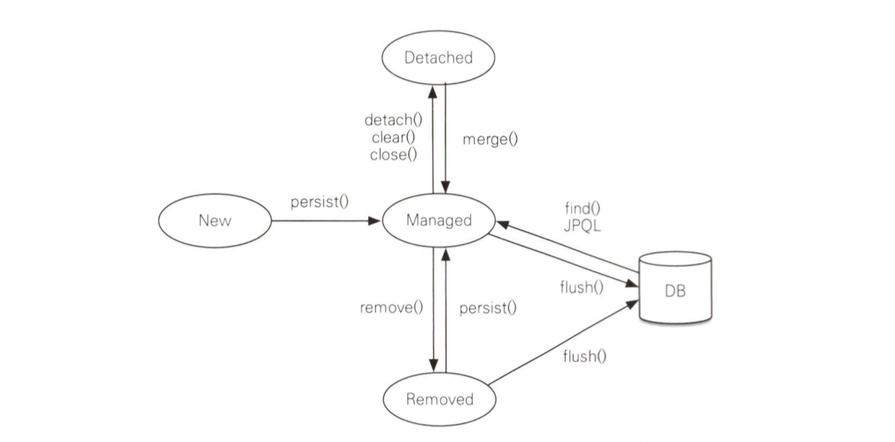
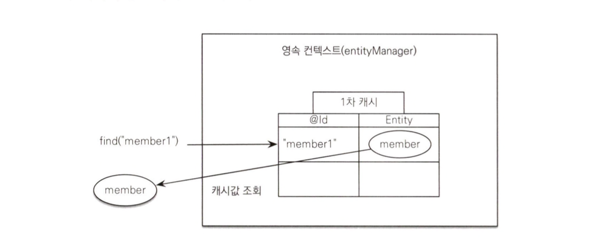
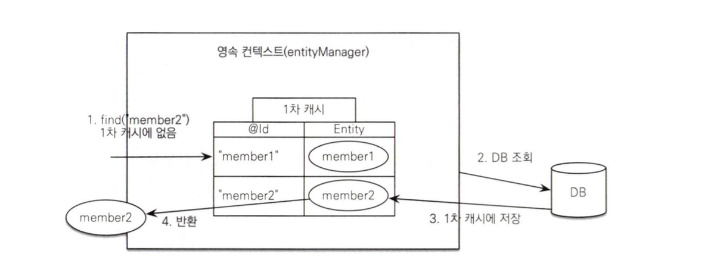
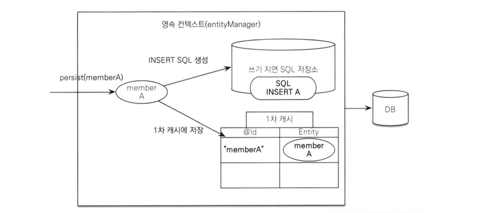
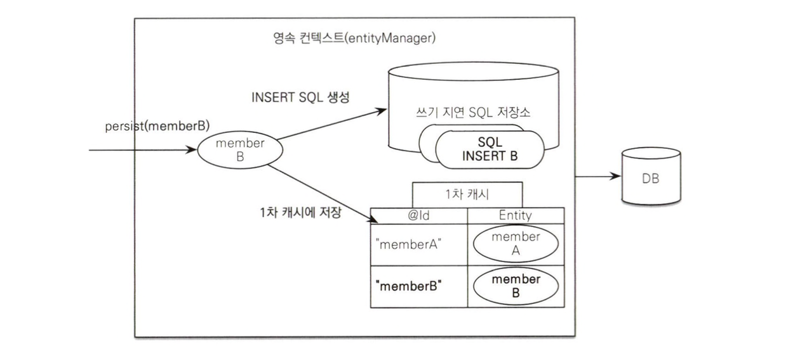
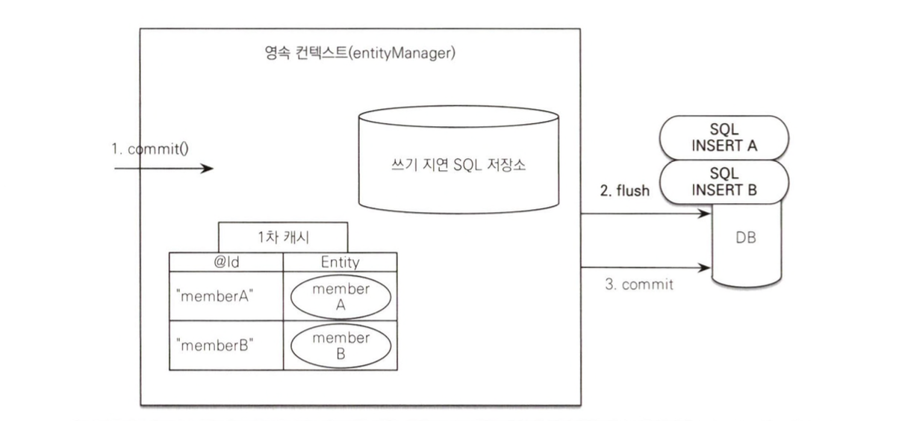

### 엔티티 매니저 팩토리와 엔티티 매니저
데이터베이스를 하나만 사용하는 애플리케이션은 일반적으로 `EntityManagerFactory`를 하나만 생성한다. 
이렇게 만든 팩토리 객체에서 필요할때마다 `EntityManager` 객체를 가져와서 사용한다.
엔티티 매니저 팩토리는 여러 스레드가 동시에 접근해도 안전하므로 서로 다른 스레드간에 공유해도 되지만, 엔티티 매니저는 **여러 스레드가 동시에 접근하면 동시성 문제가 발생하므로 스레드 간에 절대 공유하면 안된다.** 

### 영속성 컨텍스트란?
영속성 컨텍스트란 **엔티티를 영구 저장하는 환경**이라는 뜻이다.
이것은 논리적인 개념에 가깝고 눈에 보이지 않는다. 
영속성 컨텍스트는 **엔티티 매니저를 생성할 때 만들어지며**, 엔티티 매니저를 통해서 영속성 컨텍스트에 접근할 수 있고 영속성 컨텍스트를 관리할 수 있다.
### 엔티티의 생명 주기
엔티티에는 4가지 상태가 존재한다.

- 비영속 (new/transient) : 영속성 컨텍스트와 관계가 없는 상태
	- 엔티티 객체를 생성한 상태
	- 영속성 컨텍스트나 데이터베이스와는 전혀 관련이 없는 상태
- 영속 (managed) : 영속성 컨텍스트에 저장된 상태
	- 엔티티 매니저를 통해서 엔티티를 영속성 컨텍스트에 저장한 상태
	- 영속상태라는 것은 영속성 컨텍스트에 의해 관리된다는 뜻
- 준영속 (detached) : 영속성 컨텍스트에 저장되었다가 분리된 상태
	- 엔티티를 영속성 컨텍스트가 관리하지 않으면 준영속 상태가 됨
	- `em.detach()`, `em.close()`, `em.clear()`를 호출하여 가능
- 삭제 (removed) : 삭제된 상태
	- 엔티티를 영속성 컨텍스트와 데이터베이스에서 삭제된 상태
	- `em.remove(member)`
### 영속성 컨텍스트의 특징
- 영속성 컨텍스트와 식별자 값
	- 영속성 컨텍스트는 엔티티를 식별자 값(`@Id`로 매핑한 값)으로 구분한다.
- 영속성 컨텍스트와 데이터베이스 저장
	- 영속성 컨텍스트에 엔티티를 저장하면 데이터베이스에 이를 반영하는데 이것을 플러시(flush)라고한다.
- 영속성 컨텍스트가 엔티티를 관리하면 다음과 같은 장점이있다.
	- 1차 캐시
	- 동일성 보장
	- 트랜잭션을 지원하는 쓰기 지연
	- 변경 감지
	- 지연 로딩
#### 1차 캐시
`em.find()`를 호출하면 우선 1차 캐시에서 식별자 값으로 엔티티를 찾는다.
만약 찾는 엔티티가 있으면 데이터베이스를 조회하지 않고 메모리에 있는 1차 캐시에서 엔티티를 조회한다.

만약 1차 캐시에 데이터가 없으면 엔티티 매니저는 데이터베이스를 조회해서 엔티티를 생성한다. 그리고 1차 캐시에 저장한 후에 영속상태의 엔티티를 반환한다.

#### 영속 엔티티의 동일성 보장
영속성 컨텍스트는 성능상 이점과 엔티티의 동일성을 보장한다.

> **동일성과 동등성**
> 동일성(identity) : 실제 인스턴스가 같다. `==`비교의 값이 같다.
> 동등성(equality) : 실제 인스턴스는 다를 수 있지만 인스턴스가 가지고 있는 값이 같다.

#### 트랜잭션을 지원하는 쓰기지연
엔티티 매니저는 트랜잭션을 커밋하기 직전까지 데이터베이스에 엔티티를 저장하지 않고 INSERT SQL을 차곡차곡 모아둔다. 그리고 커밋시에 쿼리를 데이터베이스에 보내는데 이걸 쓰기 지연이라고 한다.

이 기능을 잘 활용하면 모아둔 등록 쿼리를 데이터베이스에 한 번에 전달해서 성능을 최적화 할 수 있다.
#### 변경감지
JPA는 엔티티를 영속성 컨텍스트에 보관할 때, 최초 상태를 복사해서 저장해두는데 이를 스냅샷이라고 한다. 
그리고 플러시 시점에 스냅샷과 엔티티를 비교해서 변경된 엔티티를 찾는다.

> 변경 감지는 영속성 컨텍스트가 관리하는 영속상태의 엔티티에만 적용된다.
> 비영속, 준영속처럼 영속성 컨텍스트의 관리를 받지 못하는 엔티티는 값을 변경해도 데이터베이스에 반영되지 않는다.

### 플러시
영속성 컨텍스트를 플러시하는 방법은 3가지이다.
- 직접호출
	- 엔티티 매니저의 `flush()`메소드를 호출해서 영속성 컨텍스트를 강제로 플러시 가능
- 트랜잭션 커밋 시 플러시 자동 호출
	- 데이터베이스에 변경 내용을 SQL로 전달하지 않고 트랜잭션만 커밋하면 어떤 데이터도 데이터베이스에 반영되지않는다. 
	- 따라서 JPA는 트랜잭션 커밋메서드에 flush 기능이 포함되어있다.
- JPQL 쿼리 실행 시 플러시 자동 호출
	- JPQL을 호출할 때에도 플러시는 자동 호출 된다.