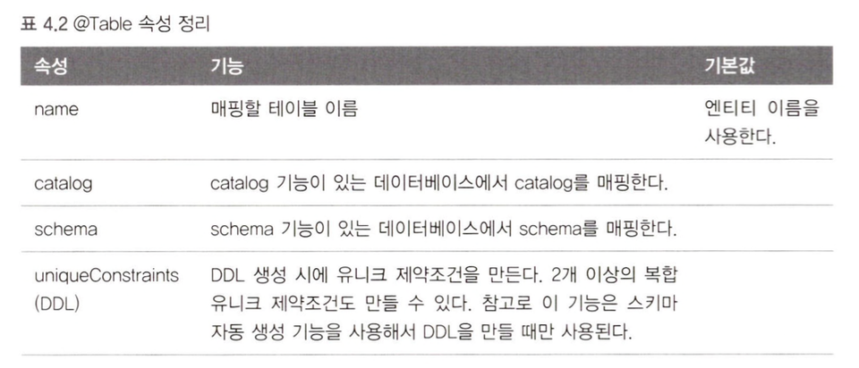
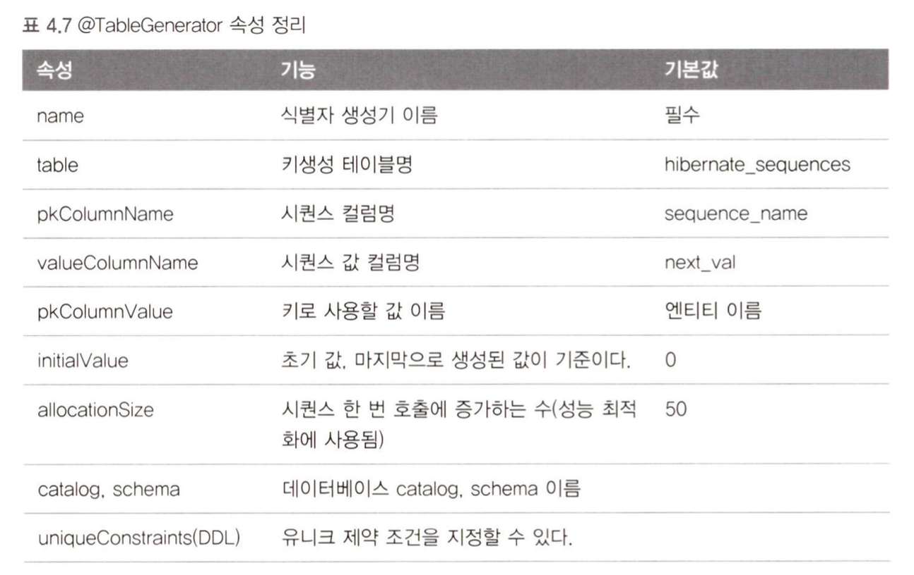
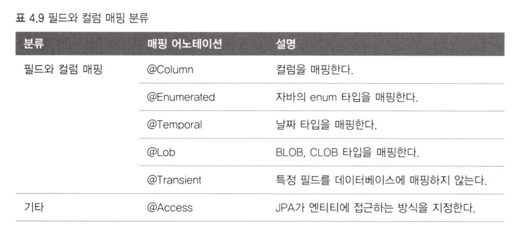

JPA를 사용하는데 가장 중요한 것은 **엔티티와 테이블을 정확히 매핑**하는 것이다.
따라서 어노테이션을 숙지하고 사용해야한다.
- 객체와 테이블 매핑: `@Entity, @Table`
- 기본 키 매핑: `@Id`
- 필드와 컬럼매핑: `@Column`
- 연관관계 매핑: `@ManyToOne`, `@JoinColumn`

### `@Entity`
JPA를 사용해서 테이블과 매핑할 클래스는 반드시 이 어노테이션이 붙어야한다. 이는 JPA가 관리하며 **엔티티**라고 부른다. 
엔티티를 붙인 클래스는 다음의 조건이 있다.
1. 기본 생성자는 필수이다
2. `final`클래스 또는 `interface`,`enum`,`inner class`에는 사용할 수 없다
3. 저장할 필드에 final을 사용하면 안된다

### `@Table`
테이블은 엔티티와 매핑할 테이블을 직접 지정한다.
생략하면 클래스 이름을 테이블로 자동 매핑한다.


### 데이터베이스 스키마 자동생성
JPA는 데이터베이스 스키마를 자동으로 생성하는 기능을 지원한다. 클래스의 매핑 정보를 보면 어떤 테이블에 어떤 컬럼을 매핑하는지 알 수 있기 때문이다.

아래 옵션을 설정파일에 포함시켜 사용가능하다.
```xml
<property name="hibernate.hbm2ddl.auto" value="create"/>
```

스키마 자동생성의 경우 운영환경에서 사용할 만큼 확실한 도구가 아니기에 예시를 파악하는 정도로만 사용하자.

---
### 기본 키 매핑
지금까지는 id의 값을 직접 할당하였다.
```java
@Id  
@Column(name="ID")  
private String id;
```
여기서 직접할당이 아닌 MySQL의 Auto Increment 등의 기능을 사용하려면 어떻게 해야할까?

JPA 는 기본 키 할당에 대해 두개의 전략을 채택하고있다.
- 직접 할당: 기본 키를 애플리케이션에서 직접 할당한다.
- 자동 생성: 대리 키를 사용한다.
	- IDENTITY : 기본 키 생성을 데이터베이스에 위임한다.
	- SEQUENCE : 데이터베이스 시퀸스를 활용하여 기본 키를 매핑한다.
	- TABLE : 키 생성 테이블을 사용한다.

#### IDENTITY 전략
IDENTITY는 기본 키 생성을 데이터베이스에 위임하는 전략이다.
예를 들어 MySQL의 AUTO_INCREMENT 기능은 데이터베이스가 기본 키를 자동으로 생성해준다.
```sql
ID INT NOT NULL AUTO_INCREMENT PRIMARY KEY,
```
```java
@Id  
@GeneratedValue(strategy = GenerationType.IDENTITY)  
private long id;
```

#### SEQUENCE 전략
데이터베이스 시퀀스는 유일한 값을 순서대로 생성하는 특별한 데이터베이스 오브젝트다. 
```sql
CREATE TABLE BOARD (
	ID BIGINT NOT NULL PRIMARY KEY,
	DATA VARCHAR(255)
)

CREATE SEQUENCE BOARD_SEQ START WITH 1 INCREMENT BY 1;
```
```java
@Id  
@GeneratedValue(strategy = GenerationType.SEQUENCE
				, generator = "BOARD_SEQ_GENERATOR")  
private Long id;
```
#### TABLE 전략
TABLE 전략은 키 생성 전용 테이블을 하나 만들고 여기에 이름과 값으로 사용할 컬럼을 만들어 데이터베이스 시퀀스를 흉내내는 전략이다.
```sql
create table MY_SEQUENCES (
	sequence_name varchar(255) not null ,
	next_val bigint,
	primary key ( sequence_name )
)
```
```java
@Entity
@TableGenerator(
    name = "BOARD_SEQ_GENERATOR",
    table = "MY_SEQUENCES",
    pkColumnValue = "BOARD_SEQ",
    allocationSize = 1
)
public class Board {
    @Id
    @GeneratedValue(strategy = GenerationType.TABLE, 
    generator = "BOARD_SEQ_GENERATOR")
    private Long id;
}
```
#### `@TableGenerator`는 다음의 규칙을 따른다.


---
### 필드와 컬럼 매핑: 레퍼런스

각 옵션에 대해선 필요할 때 찾아보는게 효율적이다.

