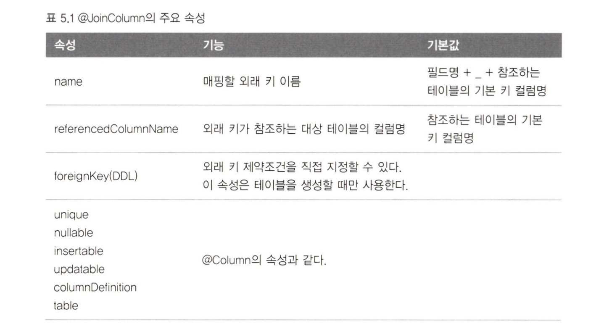

객체의 참조와 테이블의 외래 키를 매핑하는 것이 이 장의 목표이다.
- 방향(Direction) : 단방향과 양방향이 있다. 
	- 단방향 : 두 객체가 있을 때 한쪽만 반대쪽을 참조하는 경우
	- 양방향 : 서로 참조하는 경우
- 다중성(Multiplicity) : 다대일, 일대다, 일대일, 다대다 관계가 있다
- 연관관계의 주인(Owner) : 양방향 연관관계에서는 연관관계의 주인이 있어야한다.

### 단방향 연관관계
가장 대표적으로 다대일 단방향 관계가 있다.

- 객체 연관관계 
	- 회원 객체와 팀객체는 단방향 관계
	- 반대로 접근하는 필드는 없다
- 테이블 연관관계
	- `TEAM_ID`라는 외래 키로 테이블과 연관관계를 맺느다.
	- 회원테이블과 팀 테이블은 양방향관계이다.
	- 외래 키를 통해서 회원과 팀을 조인할 수 있고 반대로 팀과 회원도 조인할 수 있다.
```sql
SELECT *
FROM MEMBER M
JOIN TEAM T ON M.TEAMJD 二 T.TEAM_ID

SELECT *
FROM TEAM T
JOIN MEMBER M ON T.TEAM_ID = M.TEAM_ID
```

**객체 연관관계 vs 테이블 연관관계 정리**
- 객체는 참조(주소)로 연관관계를 맺는다. `a.getB().getC()`
- 테이블은 외래 키로 연관관계를 맺는다. `JOIN`
```java
@Entity  
public class Team {  
    @Id  
    @Column(name = "TEAM_ID")  
    private String id;  
    private String name;
}
```
```java
@Entity  
public class Member {  
    @Id  
    @Column(name = "MEMBER_ID")  
    private String id;  
    private String username;  
    @ManyToOne  
    @JoinColumn(name = "TEAM_ID")  
    private Team team;
}
```
- `@ManyToOne` 다대일 관계라는 매핑 정보이다.
- `@JoinColumn(name="TEAM_ID")`  : 조인 컬럼은 외래 키를 매핑 할 때 지정한다.


#### 연관관계를 갖는 객체 저장
다음 코드로 관계를 갖는 객체를 저장할 수 있다.
```java
private static void testSave(EntityManager em) {  
    Team team1 = new Team("team1", "팀1");  
    em.persist(team1);  
      
    Member member1 = new Member("member1", "회원1");  
    member1.setTeam(team1);  
    em.persist(member1);  
  
    Member member2 = new Member("member2", "회원2");  
    member2.setTeam(team1);  
    em.persist(member2);  
}
```

#### 연관관계를 갖는 객체 조회
연관관계가 있는 엔티티를 조회하는 방법은 크게 2가지이다.
- 객체 그래프 탐색(객체 연관관계를 이용한 조회)
```java
Member member = em.find(Member.class, "member1");
Team team = meam.getTeam();
```
- 객체지향 쿼리 사용(JPQL)
```java
String jpql = "select m from Member m join m.team t where " 
	+ "t.name=:teamName";
```
`:teamName`과 같이 :로 시작하는 것은 파라미터 바인딩을 받는 문법이다. jpql은 sql보다 간결하다는 장점이 있다.

#### 연관관계를 갖는 객체 수정
```java
Member member1 = em.find(Member.class, "member1");
member1.setTeam(null);
```

#### 연관된 엔티티 삭제
연관된 엔티티를 삭제하려면 연관관계를 먼저 끊어야한다. 그렇지 않으면 데이터베이스에서 오류가 발생한다.
```java
member1.setTeam(null);
member2.setTeam(null);
em.remove(team);
```
---
### 양방향 연관관계

회원과 팀은 다대일 관계이다. 반대로 팀에서 회원은 일대다 관계이다. 
일대다관계는 여러건과 연관관계를 맺을 수 있으므로 컬렉션 (리스트, 맵, 셋 등)을 사용하여야한다.
- 회원 → 팀 (Member.team)
- 팀 → 회원 (Team.members)

팀 엔티티를 수정한다.
```java
@Entity  
public class Team {  
    @Id  
    @Column(name = "TEAM_ID")  
    private String id;  
    private String name;   
    @OneToMany(mappedBy = "team")  
    private List<Member> members = new ArrayList<>();
}
```
- `mappedBy` 속성은 양방향 매핑일 때 사용하는데 반대쪽 매핑의 필드 이름을 값으로 주면 된다.
### 연관관계의 주인
양방향 연관관계는 엄밀히 말하면 존재하지 않는다. 서로 다른 단방향 연관관계 2개를 애플리케이션 로직으로 잘 묶어서 양방향인 것처럼 보이게 할 뿐이다.

- 테이블은 외래 키 하나로 두 테이블의 연관관계를 관리한다
- 엔티티들 단방향으로 매핑하면 참조를 하나만 사용하므로
- 엔티티를 양방향 연관관계로 설정하면 객체의 참조는 둘인데 외래 키는 하나다. 따라서 둘 사이에 차이가 발생한다.
- 이런 이유로 두 객체 연관관계 중 하나를 정해서 테이블의 외래키를 관리하는데 이걸 연관관계의 주인 이라고한다.

#### 양방향 매핑의 규칙: 연관관계의 주인
연관관계의 주인만이 데이터베이스 연관관계와 매핑되고 외래 키를 관리할 수 있다. 
주인이 아닌쪽은 읽기만 할 수 있다.
- 주인은 `mappedBy` 속성을 사용하지 않는다.
- 주인이 아니면 `mappedBy` 속성을 적용해서 연관관계의 주인을 지정해야한다.

#### 양방향 매핑의 규칙: 주인은 외래키가 있는 곳
연관관계의 주인은 외래 키가 있는 곳으로 설정해야한다. 주인이 아닌 반대편(inverse, non-owning side)은 읽기만 가능하고 외래키를 변경하지는 못한다.

데이터베이스 테이블에서 다대일, 일대다 관계에서는 항상 **다 쪽**에서 외래 키를 가진다. **다 쪽**인 `@ManyToOne`은 항상 연관관계의 주인이 되므로 `mappedBy`를 설정할 수 없다. 따라서 `@ManyToOne`에는 mappedBy 속성이 없다.

