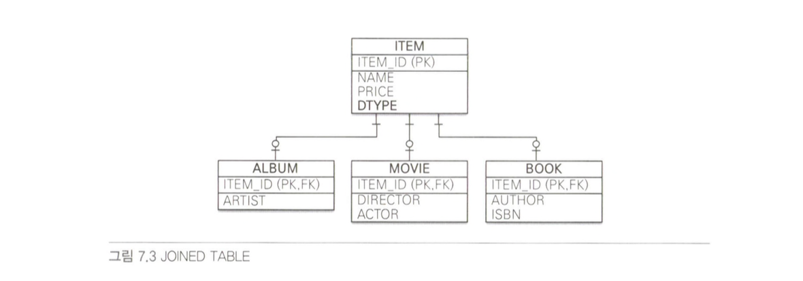
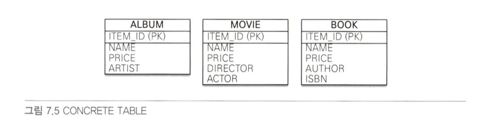

### 1. 상속 관계 매핑
관계형 데이터베이스에는 객체지향 언어에서 다루는 상속이라는 개념이 없다. 
대신 아래 그림과 같은 슈퍼타입-서브타입 관계라는 모델링 기법이 객체의 상속개념과 유사하다.

슈퍼타입-서브타입 논리 모델을 실제 물리 모델인 테이블로 구현할 때는 3가지 방법을 선택할 수 있다.
#### 조인 전략
조인 전략은 각각을 모두 테이블로 만들고 자식 테이블이 부모 테이블의 기본 키를 받아서 기본 키 + 외래 키로 사용하는 전략이다. 따라서 조회할 때 조인을 자주 사용한다.
이 전략을 사용할 때 주의할 점은 객체는 타입으로 구분할 수 있지만 테이블은 타입의 개념이 없다는 것이다. 따라서 **타입을 구분하는 컬럼**을 추가해야한다. (여기서는 DTYPE을 사용)

```java
@Entity
@Inheritance(strategy = InheritanceType.JOINED) // 1
@DiscriminatorColumn(name = "DTYPE") // 2
public abstract class Item {

    @Id
    @GeneratedValue
    @Column(name = "ITEM_ID")
    private Long id;

    private String name; // 이름
    private int price; // 가격
    ...
}

@Entity
@DiscriminatorValue("A")
public class Album extends Item {
    private String artist;
    ...
}

@Entity
@DiscriminatorValue("M") // 3
public class Movie extends Item {
    private String director; // 감독
    private String actor; // 배우
    ...
}
```
- 1 : 상속 매핑은 부모 클래스의 `@Inheritance`를 사용해야한다. 그리고 매핑 전략을 지정해야하는데 조인 전략은 `Inheritance.JOINED`를 사용했다.
- 2 : `@DescriminatorColumn(name="DTYPE")`는 부모 클래스에 구분 컬럼을 지정한다. 기본값이 `DTYPE`이므로 생략해도된다
- 3 : `@DiscriminatorValue("M")`는 엔티티를 저장할 때 구분 컬럼에 입력할 값을 지정한다. 여기선 M이 입력된다.

| 장점                        | 단점                              |
| ------------------------- | ------------------------------- |
| 테이블이 정규화된다                | 조회할 때 조인이 많이 사용되므로 성능이 저하될 수 있다 |
| 외래키 참조 무결성 제약조건을 활용할 수 있다 | 조회 쿼리가 복잡하다                     |
| 저장공간을 효율적으로 사용한다          | 데이터를 등록할 INSERT를 두번 실행한다        |
#### 단일 테이블 전략
단일 테이블 전략은 그대로 테이블을 하나만 사용하며, 구분 컬럼(DTYPE)으로 어떤 자식 데이터가 저장되었는지 구분한다. 
조회할때 조인을 사용하지 않으므로 일반적으로 가장 빠르다.
이 전략을 사용할 때 주의점은 자식 엔티티가 매핑한 컬럼은 모두 `null`을 허용해야한다는 점이다. `DTYPE`에 따라 사용하지 않는 칼럼이 존재하기 때문이다.


```java
@Entity
@Inheritance(strategy = InheritanceType.SINGLE_TABLE)
@DiscriminatorColumn(name = "DTYPE")
public abstract class Item {

    @Id
    @GeneratedValue
    @Column(name = "ITEM_ID")
    private Long id;

    private String name; // 이름
    private int price;   // 가격
    ...
}

@Entity
@DiscriminatorValue("A")
public class Album extends Item { ... }

@Entity
@DiscriminatorValue("M")
public class Movie extends Item { ... }

@Entity
@DiscriminatorValue("B")
public class Book extends Item { ... }
```
테이블 하나에 모든 것을 통합하므로 구분 컬럼을 필수로 사용해야한다. 
단일 테이블 전략의 장단점은 하나의 테이블을 사용하는 특징과 관련 있다.
`@DiscriminatorValue`를 별도로 지정하지 않으면 기본으로 엔티티 이름을 사용한다.

| 장점                  | 단점                               |
| ------------------- | -------------------------------- |
| 조인이 필요없어서 조회성능이 빠르다 | 자식 엔티티가 매핑한 컬럼은 null을 허용해야한다     |
| 조회 쿼리가 단순하다         | 단일 테이블에 모든 것을 저장하므로 테이블이 커질 수 있다 |
#### 구현 클래스마다 테이블 전략
자식 엔티티마다 테이블을 만들고 각각 필요한 컬럼이 존재한다.

```java
@Entity
@Inheritance(strategy = InheritanceType.TABLE_PER_CLASS)
public abstract class Item {

    @Id
    @GeneratedValue
    @Column(name = "ITEM_ID")
    private Long id;

    private String name; // 이름
    private int price;   // 가격
    ...
}

@Entity
public class Album extends Item { ... }

@Entity
public class Movie extends Item { ... }

@Entity
public class Book extends Item { ... }
```
일반적으로 추천하지 않는 전략이다. (데이터베이스 설계자와 ORM 전문가 둘 다 추천하지 않는 전략이다)

| 장점                      | 단점                    |
| ----------------------- | --------------------- |
| 서브 타입을 구분해서 처리할 때 효과적이다 | SQL에 UNION을 써야해서 느리다  |
| not null 제약조건을 사용가능하다   | 자식 테이블을 통합해서 쿼리하기 어렵다 |

---

### 2. Mapped Super Class
251페이지부터 다시공부